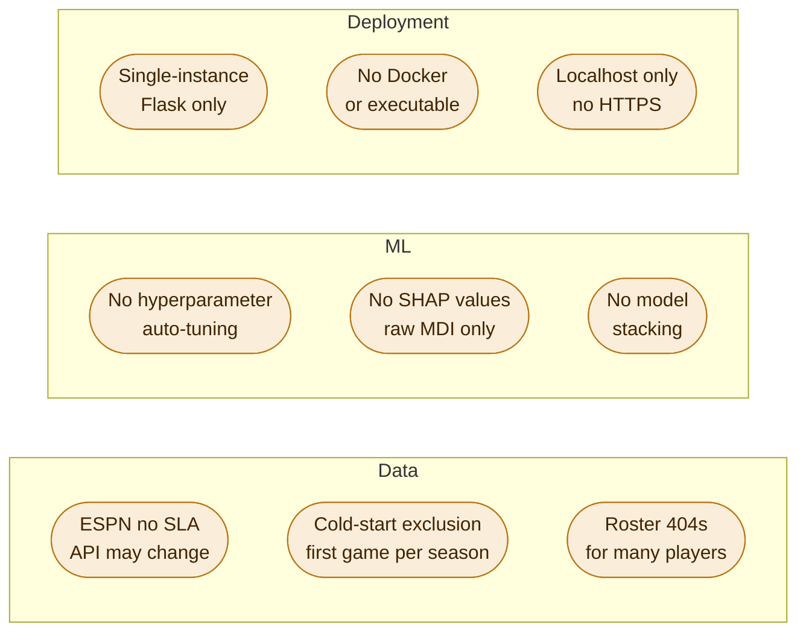
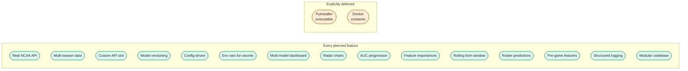
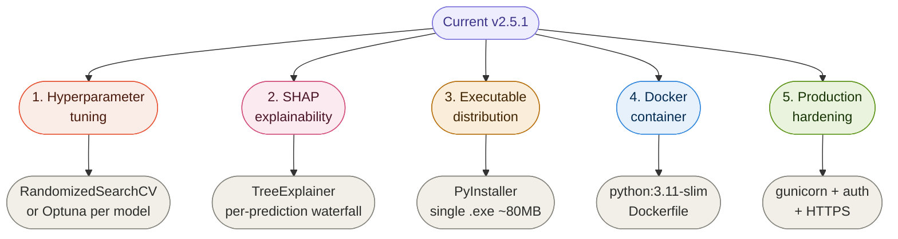

# Future Development Map


Current system state and genuine remaining enhancement opportunities. Version 2.5.1.

---

## Table of Contents

1. [Current System State](#current-system-state)
2. [What Was Planned vs What Got Built](#what-was-planned-vs-what-got-built)
3. [Genuine Remaining Work](#genuine-remaining-work)
4. [Out of Scope](#out-of-scope)

---

## Current System State

Here is the full picture of what is running, what is limited, and why.

```mermaid
flowchart TD
    subgraph Data["Data Layer"]
        D1([ESPN API\n3 seasons\n~2900 games]):::done
        D2([Synthetic\nfallback]):::done
        D3([Custom API\nstub]):::done
        D4([Snowflake\nprovisioned]):::done
    end

    subgraph ETL["ETL Pipeline"]
        E1([Deduplication\nby game_id]):::done
        E2([Pre-game\nenrichment]):::done
        E3([Leakage\nvalidation]):::done
    end

    subgraph Models["Model Layer"]
        M1([6 models\nin competition]):::done
        M2([Adaptive\ndepth]):::done
        M3([5-fold CV\nROC-AUC]):::done
        M4([Versioned\nregistry]):::done
    end

    subgraph Serve["Serving Layer"]
        S1([Flask API\n18 endpoints]):::done
        S2([Auto-learn\nscheduler]):::done
        S3([6-tab\ndashboard]):::done
        S4([Roster\nmode]):::done
    end

    subgraph Gaps["Remaining Gaps"]
        G1([Hyperparameter\ntuning]):::todo
        G2([SHAP\nvalues]):::todo
        G3([Docker\ncontainer]):::todo
        G4([Gunicorn\nproduction]):::todo
        G5([Executable\ndistribution]):::todo
    end

    Data --> ETL --> Models --> Serve
    Serve -.->|not yet| Gaps

    classDef done fill:#e1f5ee,stroke:#1D9E75,color:#04342c
    classDef todo fill:#faeeda,stroke:#BA7517,color:#412402
```



---

## What Is Working

### Data Ingestion


- Real NCAA game data via ESPN unofficial API, no key required
- Multi-season fetch across 2022, 2023, 2024 — approximately 2900 games total
- Automatic deduplication by `game_id`, safe to run `--fetch` repeatedly
- `game_date` extracted from ESPN event metadata for correct chronological ordering
- Synthetic data fallback for offline use or cold-start bootstrapping
- Custom API stub for plugging in any external provider via config field map

### Pre-Game Enrichment


- `enrich_with_pregame_averages()` replaces in-game box score statistics with rolling averages from prior games
- Feature fields now contain what was knowable before tipoff
- Original in-game stats preserved under `home_game_*` / `away_game_*` for analytics display
- `pregame_enriched` flag on every record; training filters to `True`-only records
- `--enrich` back-fills existing `games.json` without re-fetching
- Cold-start records correctly excluded from training
- `pregame_window` (default 10) and `pregame_min_games` (default 1) configurable in `config.yaml`

### Storage


- Local JSON as default, zero setup required
- Snowflake fully provisioned, disabled by default, enabled via config flag and env vars
- Both backends share the same interface; switching is a single CLI flag (`--storage snowflake`)

### Models


- Five models trained and compared every run: Gradient Boosting, Random Forest, Extra Trees, SVM (RBF), Neural Network (MLP), plus XGBoost as optional sixth
- All wrapped in `StandardScaler -> estimator` Pipeline
- 5-fold cross-validated ROC-AUC as selection metric
- Adaptive tree depth: `log2(n_samples / (10 x n_features))` cap prevents overfitting
- Per-model feature importances extracted where available
- Hyperparameters calibrated for fairness across all models at the current dataset size

### Model Registry and Versioning


- Every training run registers a versioned `.pkl` (v1, v2, v3 ...)
- `models/registry.json` tracks metrics, feature list, training size, timestamp, and MD5 hash per version
- Activate any version from the dashboard or CLI (`--activate v2`)
- Automatic pruning of oldest versions beyond `keep_top_n` (default 10)

### Auto-Learning


- Background daemon thread starts automatically with `--serve`
- Fetches new games every 6 hours, retrains if 15 or more new games are added
- Forces full retrain every 24 hours regardless
- Promote-only gate: new model must beat current AUC by 0.002 to be promoted
- Every run (promoted or skipped with reason) logged to `data/learning_log.json`

### Logging


- All `print()` replaced with Python `logging` module
- `RotatingFileHandler`: `data/app.log`, 10 MB per file, 2 backups (30 MB ceiling)
- Console: INFO and above. File: DEBUG and above.
- Module-level loggers: `bball.app.fetcher`, `bball.app.models`, etc.
- `setup_logging()` called before all other imports in `main.py`

### Configuration


- Zero hardcoded values in Python. Everything lives in `config.yaml`.
- Snowflake credentials via environment variables
- Feature list, model hyperparameters, thresholds, intervals, and season list all configurable

### Roster System


- `--fetch-rosters` pre-warms cache for all teams before serving
- `RosterFetcher` resolves team names to ESPN IDs, caches to `data/team_ids.json`
- Per-team rosters cached with configurable TTL (default 24h)
- Embedded stats used first; per-player `/statistics` called only as fallback; graceful 404 handling
- Async fetch with incremental progress polling at `/roster/progress/<team>`
- `/predict/from_roster` aggregates selected players into team features with FGA-weighted FG%
- `computed_stats` and `insights` returned in the prediction response

### Dashboard


| Tab | Contents |
|-----|----------|
| Predict | Stats mode with season or rolling window auto-fill. Roster mode with live player aggregation. |
| Overview | Stats cards, outcome donut, active model radar, AUC progression over versions. |
| Model Comparison | Metrics table with inline bars, grouped bar chart, multi-model radar. |
| Feature Analysis | Home-win vs away-win averages, per-model importance chart with model selector. |
| Registry | All versions with metrics, one-click Activate, rollback support. |
| Auto-Learn | Live scheduler status, countdowns, full learning log, manual trigger button. |

### Code Structure


- Single `main.py` (previously 2000 lines) refactored into `app/` package with 10 modules
- No circular imports. Dependency chain verified.
- `main.py` is now CLI entry point only (~200 lines). All logic lives in `app/`.
- `dashboard.html` served via absolute path resolution relative to `api.py`

---

## Remaining Limitations



---

## What Was Planned vs What Got Built



Every feature planned for the academic submission was built. The two deferred items (PyInstaller and Docker) are deployment packaging, not system functionality. Both are documented in the remaining work section below.

| Planned Feature | Status | Notes |
|----------------|--------|-------|
| Real NCAA API integration |  | ESPN unofficial API, no key needed |
| Multi-season data |  | seasons: [2022, 2023, 2024], ~2900 games |
| Custom API provider slot |  | `CustomAPIFetcher` plus config `field_map` |
| Auto-fetch on train |  | Auto-learn scheduler handles this |
| Model versioning system |  | Registry with v1/v2/... plus activate and rollback |
| Config-driven architecture |  | `config.yaml`, zero hardcoded values |
| Env vars for secrets |  | `SNOWFLAKE_USER`, `SNOWFLAKE_PASSWORD` |
| Multi-model comparison dashboard |  | Full comparison tab with table and charts |
| Radar chart |  | Single-model and multi-model radar |
| Historical AUC progression |  | Line chart in Overview tab |
| Feature importance visualisation |  | Per-model horizontal bar in Features tab |
| Rolling form window |  | `build_team_stats(window=N)`, configurable windows |
| Player roster predictions |  | `RosterFetcher`, async progress, FGA-weighted aggregation |
| Pre-game features (no leakage) |  | `enrich_with_pregame_averages`, `--enrich` CLI |
| Structured logging |  | `RotatingFileHandler`, module-level loggers |
| Modular codebase |  | `app/` package, 10 modules, no circular imports |
| PyInstaller executable |  | Out of scope for this submission |
| Docker container |  | Out of scope for this submission |

---

## Genuine Remaining Work

These are real improvements that would meaningfully extend the system, in priority order.



---

### 1. Hyperparameter Tuning


Current hyperparameters in `config.yaml` are calibrated defaults, not optimised values. With 2900 real games, a tuning pass could meaningfully improve AUC.

**What is needed:**

- Add `--tune` CLI flag
- `tune_models()` running `RandomizedSearchCV` or Optuna per enabled model
- Write winning hyperparameters back to `config.yaml` automatically
- Integrate into auto-learn: tune every N retrains

---

### 2. SHAP Explainability


Current feature importances (impurity reduction for trees, `abs(coef_)` for SVM) do not account for feature interactions and can be misleading. SHAP gives per-prediction explanations: "this prediction shifted +12% because home FG% was above their season average."

**What is needed:**

- `pip install shap`
- `compute_shap(model, X_test, feature_names)` using `shap.TreeExplainer` for tree models and `shap.KernelExplainer` for SVM and MLP
- New dashboard chart: SHAP beeswarm or bar in Features tab
- Per-prediction SHAP waterfall shown alongside the prediction result

---

### 3. Executable Distribution


Reviewers should not need to configure a Python environment to run a demo.

```bash
pip install pyinstaller
pyinstaller --onefile --name basketball-predictor \
  --add-data "dashboard.html:." \
  --add-data "config.yaml:." \
  main.py
```

**Known challenges:**

| Issue | Detail |
|-------|--------|
| Binary size | Approximately 80 MB with scikit-learn and numpy |
| Snowflake connector | Known PyInstaller issues. May need to be excluded from the bundled build. |
| XGBoost | Requires separate handling for bundled builds |

---

### 4. Docker Container


```dockerfile
FROM python:3.11-slim
WORKDIR /app
COPY requirements.txt .
RUN pip install -r requirements.txt
COPY main.py dashboard.html config.yaml ./
COPY app/ ./app/
EXPOSE 5000
CMD ["python", "main.py", "--serve"]
```

```bash
docker build -t basketball-predictor .
docker run -p 5000:5000 \
  -e SNOWFLAKE_USER=... \
  -e SNOWFLAKE_PASSWORD=... \
  basketball-predictor
```

---

### 5. Production Hardening


Not needed for academic demonstration, but documents the gap between current state and production deployment.

| Change | What it fixes |
|--------|--------------|
| Replace `app.run()` with gunicorn | Multiple workers, no single-thread bottleneck |
| API key auth on `/predict` | Prevents unauthorised access |
| HTTPS via nginx reverse proxy | Encrypted transport |
| Rate limiting on prediction endpoint | Prevents abuse |

---

## Out of Scope

These remain explicitly out of scope. Each item has a reason.

| Feature | Why out of scope |
|---------|-----------------|
| Deep learning models | Dataset size does not justify it. ~2900 games is too small for transformers or CNNs to outperform well-tuned sklearn models. |
| Mobile app | Separate project requiring a separate tech stack. |
| User authentication | Not needed for a single-user demo. |
| GraphQL API | REST is sufficient and already implemented. |
| WebSockets | Polling every 15 seconds is adequate for scheduler status. Polling every 1 second is adequate for roster progress. The added complexity is not worth it. |
| Microservices | Overkill for this architecture. One process is correct here. |
| Database migrations | Snowflake schema is auto-created from config on first connect. |
| Per-game opponent strength adjustment | Meaningful improvement but requires a separate team rating system (Elo, KenPom) and an external data source. Out of scope for this iteration. |

---

## Key Principles (Unchanged)

These guided every decision in the codebase and will guide future work.

| Principle | What it means in practice |
|-----------|--------------------------|
| Config over code | If it might change, it belongs in `config.yaml` |
| Improve only | New models replace the current only if they are genuinely better |
| Fail gracefully | Missing XGBoost, disabled Snowflake, blank ESPN response, 404 roster endpoints all handled cleanly |
| Pre-game only | Features must represent information knowable before tipoff |
| Document the why | Code comments explain decisions, not just what the code does |
| Log everything | Decisions, warnings, promotions, skips all go to `data/app.log` |

---

> The goal was never perfection. It was a system that works, explains itself, trains on honest data, and keeps getting better.
