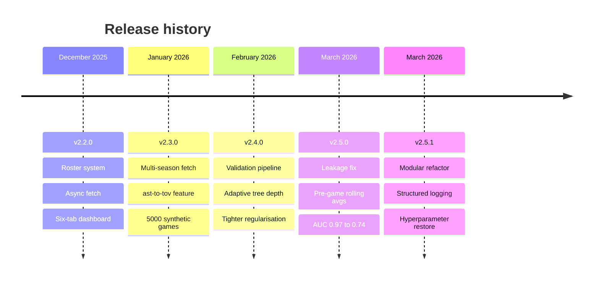
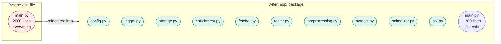
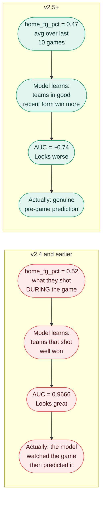

# Changelog

---

## Version History

---

## v2.5.1 — Modular Refactor and Logging

### Architecture

The biggest structural change in the project's life. `main.py` went from 2000 lines to 200.

- No circular imports. Dependency chain verified.
- `dashboard.html` served via absolute path resolution, resolves correctly regardless of working directory.

### Logging

- All `print()` replaced with Python `logging` module
- `RotatingFileHandler`: `data/app.log`, 10 MB per file, 2 backups (30 MB ceiling)
- Console: INFO and above. File: DEBUG and above.
- Module-level loggers: `bball.app.fetcher`, `bball.app.models`, etc.

### Hyperparameter Restoration

v2.4 over-regularised everything defensively. v2.5.1 restores fair values so all models compete on equal footing.

| Parameter | v2.4 | v2.5.1 | Model |
|-----------|------|--------|-------|
| `min_samples_leaf` | 4 | 2 | RF, ET, GBM |
| `min_samples_split` | 10 | 5 | RF, ET, GBM |
| `hidden_layer_sizes` | `[64, 32]` | `[128, 64, 32]` | MLP |
| `C` | 1.0 | 2.0 | SVM |
| `n_estimators` | 200 | 300 | All ensembles |
| `min_child_weight` | not set | 3 | XGBoost |

### Bug Fixes

- `XGBClassifier = None` added in `except ImportError` block to satisfy type checker
- Unused `team_history_syn` variable removed from `_generate_synthetic()`
- Unused `load_from_json` import removed from `preprocessing.py`
- Unused `MODEL_CFG` import removed from `api.py`

---

## v2.5.0 — Pre-Game Rolling Averages (The Leakage Fix)

This is the most important release. Everything before it was technically functional but mathematically dishonest.

### The Problem

### Changes

- `enrich_with_pregame_averages()` pipeline added. Replaces feature fields with rolling averages computed in chronological order.
- Original in-game stats preserved under `home_game_*` / `away_game_*` for analytics display only.
- `pregame_enriched` flag on every record. Training filters to `True`-only records.
- `game_date` extracted from ESPN event metadata for correct chronological sort order.
- `--enrich` CLI command back-fills an existing `games.json` without re-fetching.
- `prepare_data()` warns if no enriched records are found.
- AUC sanity bands added at training time: above 0.80 warns possible leakage, below 0.52 warns chance level.
- `data.pregame_window: 10` and `data.pregame_min_games: 1` added to config.

### Multi-Season Fetch

- `seasons: [2022, 2023, 2024]` in config
- `max_games: 3000` cap across all seasons
- `get_game_ids()` now returns `(game_id, game_date)` tuples
- Approximately 2900 real games across 3 seasons

### Features Removed from Model Vector

| Removed | Reason |
|---------|--------|
| `home_ppg` / `away_ppg` |  |
| `home_eff_score` / `away_eff_score` |  |

Feature count reduced from 18 to 14.

### Results After the Fix

| Metric | Before (v2.4) | After (v2.5) | Verdict |
|--------|--------------|--------------|---------|
| Best AUC | 0.9666 | ~0.74 | The drop is correct |
| Features | 18 | 14 | Removed leakage |
| Best model | varies | Gradient Boosting 74.4% | Honest competition |

The AUC went down. That is the right result.

---

## v2.4.0 — Validation and Regularisation

### Changes

- `_validate_training_data()` added with four checks before any model sees data

| Check | What it catches |
|-------|----------------|
| Leakage detection | Feature correlation above 0.70 with outcome |
| Zero-variance check | Constant features with no predictive value |
| Class balance check | Home win rate outside 40-70% |
| Sample ratio check | Fewer than 20 samples per feature |

- `_adaptive_depth()` added: scales tree `max_depth` to `log2(n_samples / (10 x n_features))`
- `build_models()` now takes `n_samples` and `n_features` for adaptive depth calculation
- Regularisation tightened: `min_samples_leaf=4`, `min_samples_split=10`, MLP `[64, 32]` (note: over-tightened here, corrected in v2.5.1)
- `analytics()` fix: `mc = fi = {}` split to separate assignments to avoid shared reference
- `_generate_synthetic()` outcome now driven by efficiency metrics, not scores

---

## v2.3.0 — Multi-Season Fetch and New Features

### Changes

- Multi-season fetch: seasons list in config, loops seasons until `max_games` cap is reached
- New derived features: `home_ast_to_tov`, `away_ast_to_tov`
- `_parse_embedded_stats` made `@staticmethod`
- `_generate_synthetic()` raised to 5000 games
- `--max-games` CLI override argument added
- `compute_stats_from_roster()` insight features added (display only, not in model vector)

---

## v2.2.0 — Roster System and Six-Tab Dashboard

### Changes

- `RosterFetcher` class: ESPN team ID lookup, roster fetch, per-player stat parsing
- Async roster fetch with live progress polling via `_roster_progress` shared state dict
- `/predict/from_roster` endpoint with FGA-weighted FG% aggregation
- `--fetch-rosters` CLI flag to pre-warm cache for all teams
- Rolling form window: `build_team_stats(window=N)`, `?window=N` query params on `/teams` and `/team_stats`
- Six-tab dashboard: Predict, Overview, Model Comparison, Feature Analysis, Registry, Auto-Learn
