# Code Flow Documentation


Complete architecture and data flow documentation for the NCAA basketball predictor system, v2.5.

---

## Table of Contents

1. [System Overview](#system-overview)
2. [Architecture Components](#architecture-components)
3. [Command Execution Flows](#command-execution-flows)
4. [Auto-Learning Pipeline](#auto-learning-pipeline)
5. [Data Flow](#data-flow)
6. [Storage Architecture](#storage-architecture)
7. [Model Training Pipeline](#model-training-pipeline)
8. [Prediction Serving](#prediction-serving)
9. [Roster System](#roster-system)
10. [Dashboard Integration](#dashboard-integration)

---

## System Overview

The basketball predictor is a config-driven, self-improving ML pipeline with a modular package structure, a background auto-learn scheduler, and a pre-game data enrichment step that eliminates the leakage present in earlier versions.

### Module Dependency Chain

No circular imports. Each module only imports from modules above it.

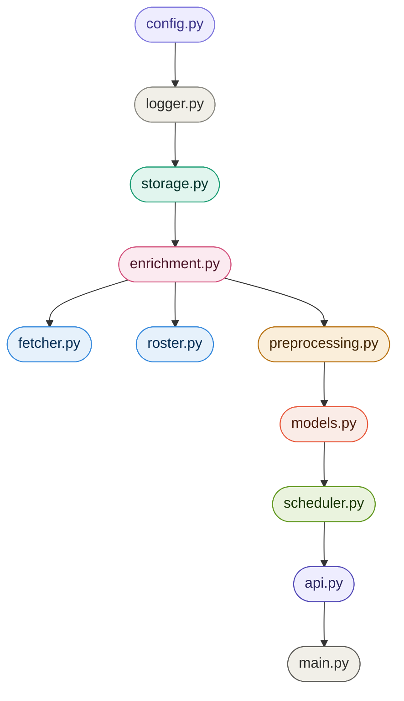

### Design Principles

| Principle | Implementation |
|-----------|---------------|
|  | All settings in `config.yaml`. No hardcoded values in Python. |
|  | Each module has exactly one responsibility. |
|  | Feature vector contains only data knowable before tipoff. |
|  | New model replaces active only if it beats current AUC + 0.002. |
|  | Every module logs to `bball.<module>`. Console + file simultaneously. |

---

## Architecture Components

### Layer 0: Config Loading


Runs at module import time. All other modules import constants from here. Nobody reads `config.yaml` directly.

```python
CFG         = load_config()
APP_CFG     = CFG["app"]
HT_CFG      = CFG["home_team"]
DATA_CFG    = CFG["data"]            # features list, paths, split sizes, pregame window
API_CFG     = CFG["ncaa_api"]        # ESPN endpoints, seasons list, rate limit
SF_CFG      = CFG["snowflake"]       # credentials via env vars
MODEL_CFG   = CFG["models"]          # enabled models and hyperparams
AL_CFG      = CFG["auto_learn"]      # intervals, thresholds
ROSTER_CFG  = CFG.get("roster", {})
ROLLING_CFG = CFG.get("rolling", {})
```

Directories (`DATA_DIR`, `MODELS_DIR`, `ROSTER_DIR`) are created at import time. Any module that writes files can assume they exist.

---

### Layer 1: Logging


Must be initialised before any other module is imported. `main.py` calls `setup_logging()` as its very first action.

```python
# main.py
from app.logger import setup_logging
setup_logging()
# now import everything else
```

Child loggers are obtained by name in each module:

```python
log = get_logger(__name__)
# produces: bball.app.fetcher, bball.app.models, etc.
```

The `_configured` guard makes `setup_logging()` idempotent. Safe to call multiple times.

---

### Layer 2: Data Ingestion


Real NCAA data. No API key required. v2.5 adds multi-season support and `game_date` extraction.

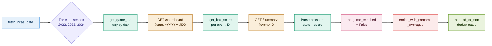

The returned record stores in-game statistics at this stage. The enrichment step replaces the feature fields with rolling averages before the record is used for training.

---

### Layer 3: Pre-Game Enrichment


This is the most important step in the pipeline. It converts raw in-game box scores into genuinely predictive pre-game features.

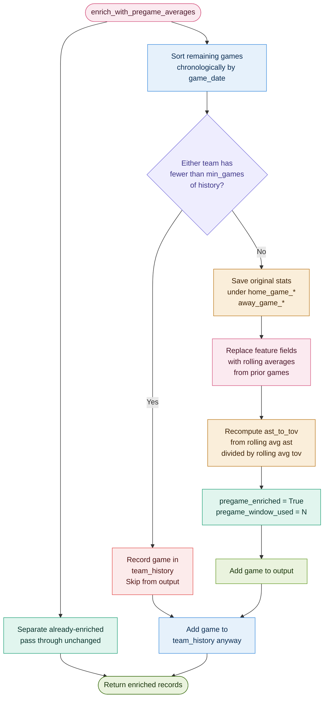

> **Before (v2.4):** `home_fg_pct = 0.52` meant what the team shot during the game. The model learned "teams that shot well won" which is circular. AUC was 0.9666 and every bit of it was leakage.
>
> **After (v2.5):** `home_fg_pct = 0.47` means what the team averaged over their last 10 games. That is knowable before tipoff.

`ast_to_tov` is computed as `rolling_avg_assists / rolling_avg_turnovers`, not as an average of per-game ratios. The ratio of averages is more accurate when denominators vary across games.

---

### Layer 4: Storage


Common interface for both backends. The rest of the codebase calls `load_data(storage)` and never knows which backend is active.

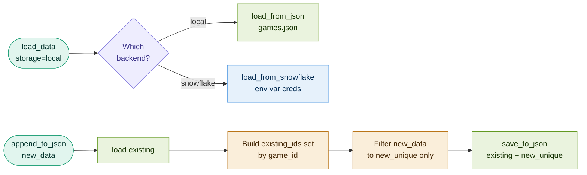

`_sanitize(obj)` recursively replaces `float('nan')` and `float('inf')` with `None`. Required because XGBoost cross-validation occasionally produces NaN scores, and `json.dumps` writes NaN literally, which is invalid JSON that crashes the browser.

---

### Layer 5: Model Training


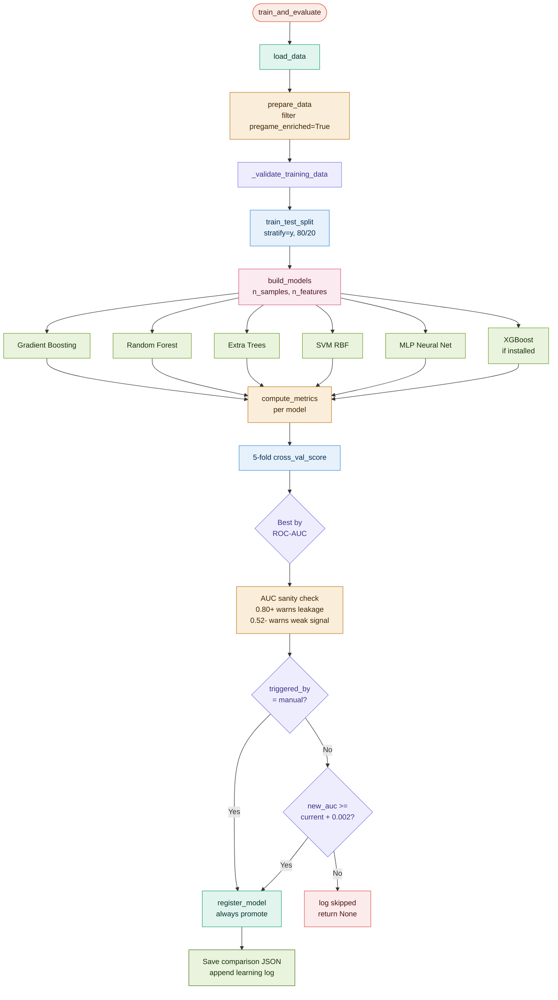

**Validation checks run before any model sees data:**

| Check | Threshold | What it catches |
|-------|-----------|----------------|
| Leakage detection | Correlation > 0.70 with outcome | Score-derived features sneaking into the feature vector |
| Zero variance | std < 0.001 | Constant features with no predictive value |
| Class balance | Home win rate outside 40-70% | Heavy imbalance that biases all predictions |
| Sample ratio | n / p < 20 | Too few samples per feature, guaranteed overfit |

**Why ROC-AUC and not accuracy:** with ~69% home wins, a model that always predicts "Home Win" hits 69% accuracy but AUC = 0.5. ROC-AUC measures whether probability estimates correctly rank home wins above away wins. It penalises models that win through class imbalance, and it is the right metric here.

**Why adaptive depth:** at n=2300 and p=14, `log2(2300 / (10 * 14)) = 4.04`. Configuring tree depth at 10 gets overridden to 4 at runtime. As more data arrives, the ceiling rises automatically.

---

## Command Execution Flows

### `python main.py --fetch`

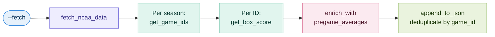

### `python main.py --enrich`

Applies enrichment to an existing `games.json` fetched before v2.5. Avoids a full re-fetch.

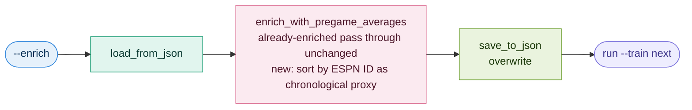

### `python main.py --train`

```mermaid
flowchart LR
    A([--train]):::cmd --> B[train_and_evaluate\ntriggered_by=manual]:::fn
    B --> C[load and prepare\n~2800 enriched games\nX: 2800x14]:::prep
    C --> D[validate\n+ split 80/20]:::validate
    D --> E[build and fit\n5-6 models]:::train
    E --> F[Best by ROC-AUC\nregister_model]:::register
    F --> G[latest_comparison.json\nlearning_log.json]:::save

    classDef cmd      fill:#e6f1fb,stroke:#378ADD,color:#042c53
    classDef fn       fill:#eeedfe,stroke:#7F77DD,color:#3c3489
    classDef prep     fill:#faeeda,stroke:#BA7517,color:#412402
    classDef validate fill:#fbeaf0,stroke:#D4537E,color:#4b1528
    classDef train    fill:#faece7,stroke:#E8593C,color:#4a1b0c
    classDef register fill:#e1f5ee,stroke:#1D9E75,color:#04342c
    classDef save     fill:#eaf3de,stroke:#639922,color:#173404
```

### `python main.py --serve`

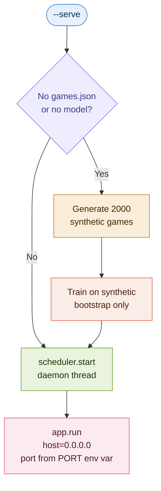

`use_reloader=False` prevents the scheduler from starting twice during Flask's debug reload cycle.

---

## Auto-Learning Pipeline

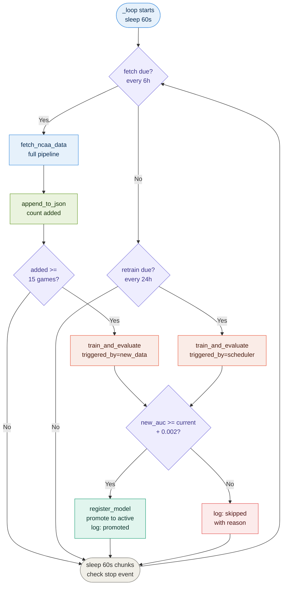

The active model's AUC is monotonically non-decreasing over time. The model can only improve or stay the same.

---

## Data Flow

### Stats Mode: End-to-End Prediction

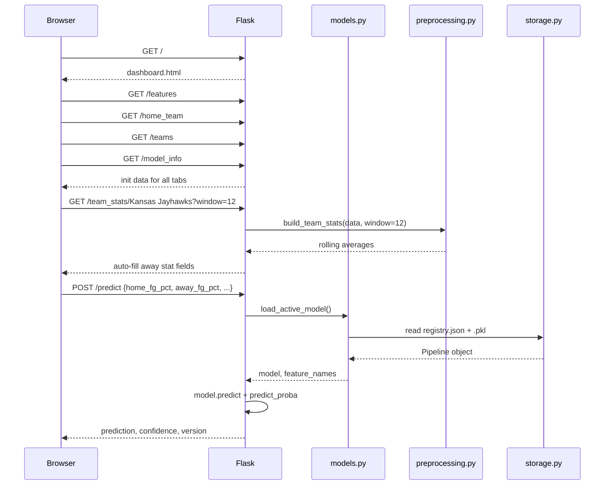

### Roster Mode: End-to-End Prediction

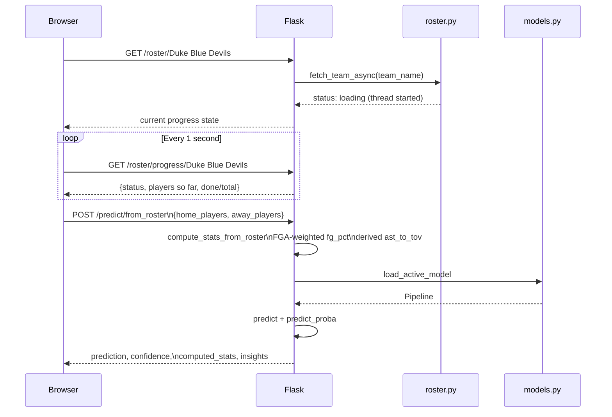

---

## Storage Architecture

### Game Record Structure (v2.5)

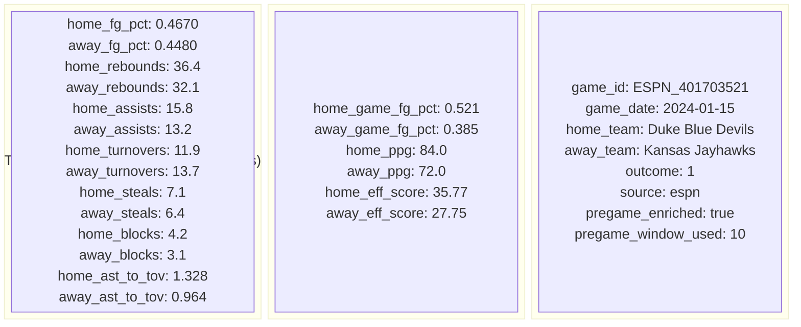

### Model Registry Structure

Each `.pkl` stores `{"model": Pipeline, "feature_names": list}`. Feature names travel with the model to prevent silent mismatches if the feature list changes between versions.

```json
{
  "active_version": "v3",
  "versions": [
    {
      "version": "v1",
      "model_name": "Gradient Boosting",
      "filename": "gradient_boosting_v1_a3f2c1d4.pkl",
      "metrics": { "roc_auc": 0.7441, "f1": 0.8161 },
      "feature_names": ["home_fg_pct", "away_fg_pct", "..."],
      "training_size": 2328,
      "trained_at": "2026-03-19T14:22:11",
      "hash": "a3f2c1d4"
    }
  ]
}
```

Pruning: when `len(versions) > keep_top_n` (default 10), oldest `.pkl` files are deleted from disk.

---

## Roster System

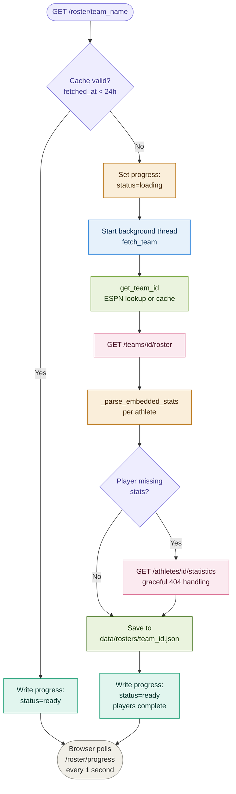

Player stats aggregation for roster-mode prediction:

- `ppg`, `rpg`, `apg`, `spg`, `bpg`, `tov` are summed across selected players
- `fg_pct` uses FGA-weighted average: `total_fgm / total_fga` (more accurate than a simple mean when players have unequal shot volume)
- `ast_to_tov` is derived from summed totals, not averaged per-player

---

## Dashboard Integration

### Tab Rendering Strategy

Charts are not drawn on page load. They are drawn fresh each time a tab becomes visible via `switchTab()`. This solves the Chart.js 0x0 canvas problem: `display:none` tabs have no dimensions at render time.

`requestAnimationFrame` defers execution by one paint cycle, ensuring the browser has applied `display:block` before Chart.js measures the canvas.

`loadAnalytics()` fetches data and updates DOM stat cards immediately but does not draw charts. This separation means a slow analytics fetch never blocks tab switching.

---

## Key Design Decisions

| Decision | Rationale |
|----------|-----------|
| Config-driven via YAML | No secrets or tunables in Python source |
| Pre-game rolling averages as features | Eliminates leakage. Model trains on knowable pre-game data. |
| `game_date` on every record | Correct chronological ordering for enrichment |
| Enrichment as a separate pipeline step | Can back-fill existing data without re-fetching |
| ROC-AUC for model selection | Robust to class imbalance (~69% home wins) |
| Stratified train-test split | Preserves class ratio in both sets |
| `Pipeline(Scaler + clf)` | Scaler trained on train set only. No leakage. |
| Adaptive tree depth | Prevents overfitting. Scales automatically with dataset size. |
| `Path(__file__).parent.parent / "dashboard.html"` | Resolves correctly from `app/api.py` to project root regardless of working directory |
| `use_reloader=False` | Prevents scheduler starting twice in Flask debug mode |
| `_sanitize()` before JSON serialisation | XGBoost CV can produce NaN. Invalid JSON crashes the browser. |
| Lazy chart rendering | Chart.js cannot render into 0x0 hidden canvases |
| Module-level `_roster_progress` dict | Shared state between Flask and background roster threads |
| FGA-weighted `fg_pct` aggregation | More accurate than simple average when players have unequal shot volume |
| `window=None` default in `build_team_stats` | Full season average unless caller explicitly requests a rolling window |
| `RotatingFileHandler` 10 MB x 2 | Bounded disk usage. Always retains recent history. |
| `setup_logging()` before all other imports | Ensures all module-level loggers attach to the configured handler ||
