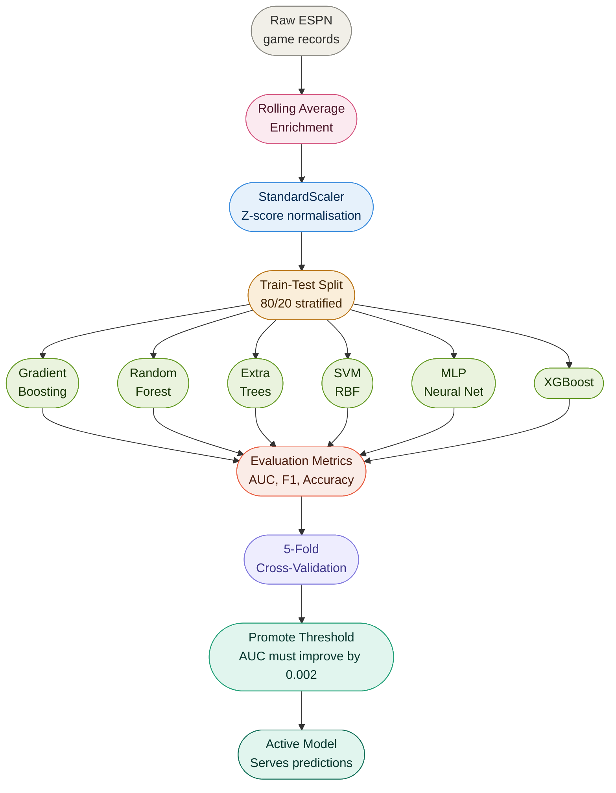
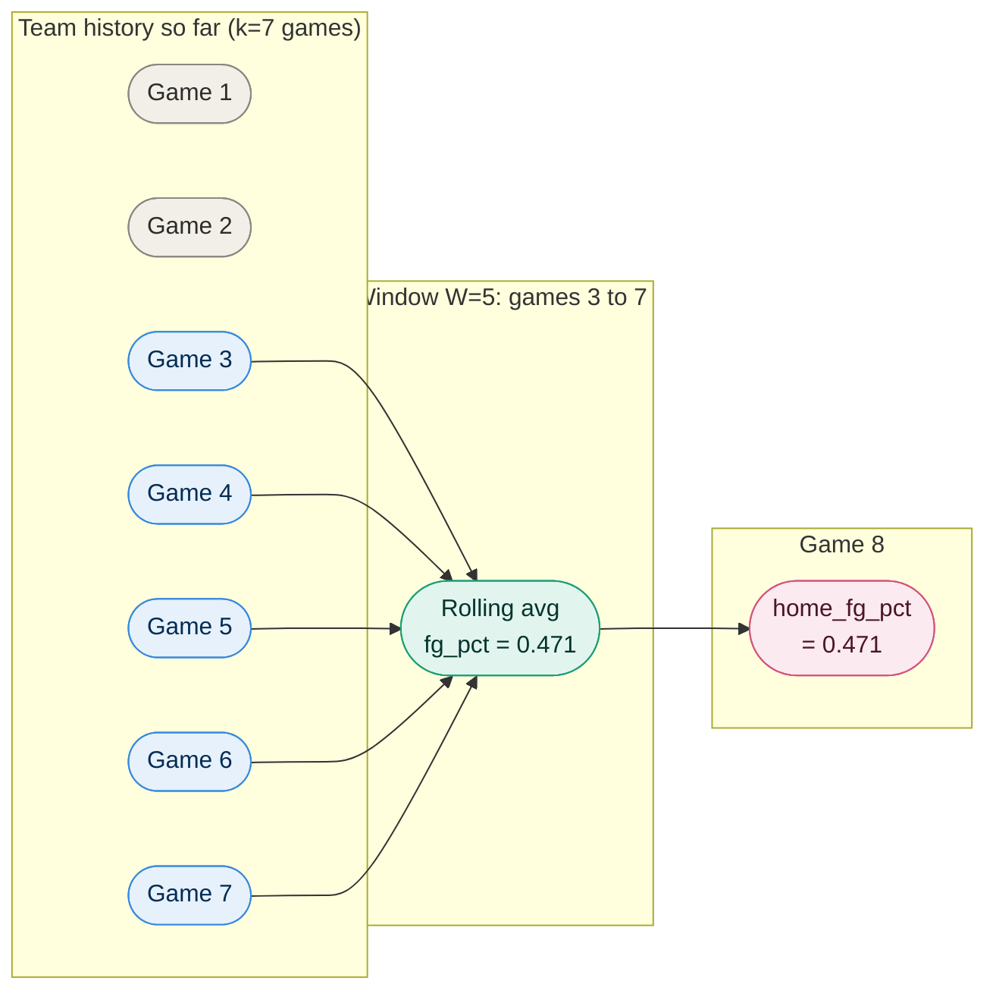
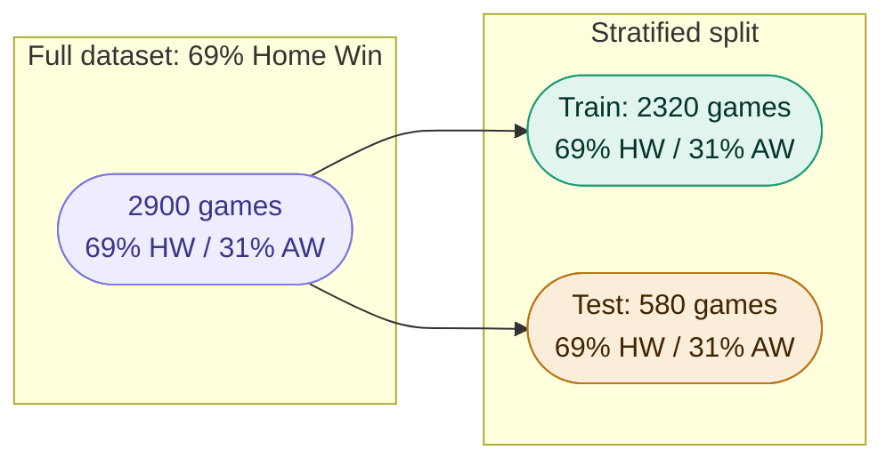
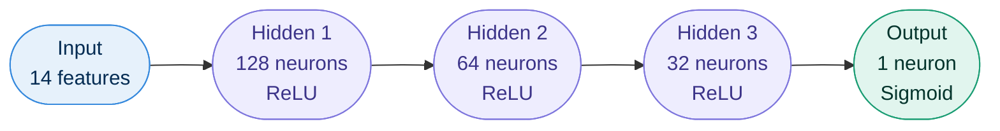
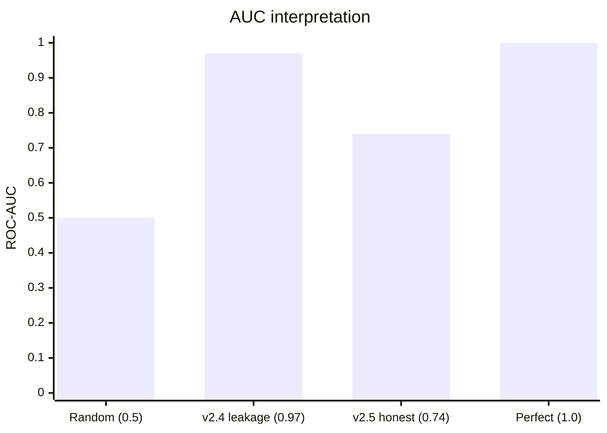
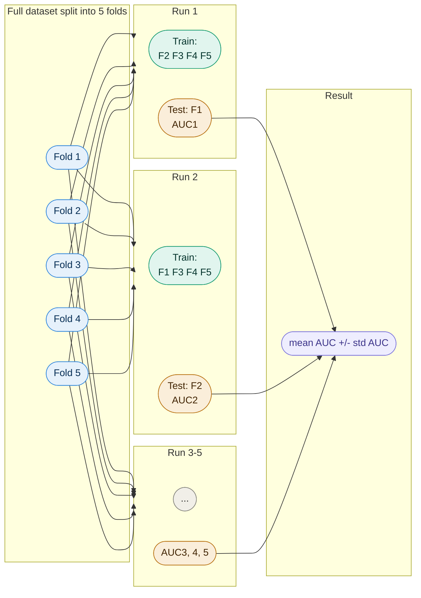
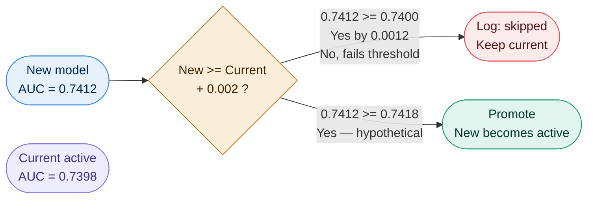

# Mathematics Reference


Every mathematical operation in the system, explained from first principles. Version 2.5.1.

---

## Table of Contents

1. [Synthetic Data Generation](#1-synthetic-data-generation)
2. [Pre-Game Rolling Average Enrichment](#2-pre-game-rolling-average-enrichment)
3. [Feature Scaling — StandardScaler](#3-feature-scaling--standardscaler)
4. [Train-Test Split](#4-train-test-split)
5. [Model Mathematics](#5-model-mathematics)
6. [Evaluation Metrics](#6-evaluation-metrics)
7. [Cross-Validation](#7-cross-validation)
8. [Feature Importances](#8-feature-importances)
9. [Team Season Averages](#9-team-season-averages)
10. [Prediction Confidence](#10-prediction-confidence)
11. [Promote Threshold](#11-promote-threshold)
12. [Adaptive Tree Depth](#12-adaptive-tree-depth)

---

## How the Math Fits Together

Before reading individual sections, here is where each mathematical operation lives in the pipeline:



---

## 1. Synthetic Data Generation


Used only by `_generate_synthetic()` as a fallback when ESPN is unavailable. Synthetic records are passed through the full enrichment pipeline before training, so the model never sees raw generated stats.

### Strength Score

Each team is assigned a scalar strength score from a weighted sum of their features:

$$S_{home} = fg \cdot 100 + rb \cdot 0.5 + ast \cdot 0.8 - tov \cdot 0.6 + stl \cdot 0.4 + blk \cdot 0.3 + 3$$

$$S_{away} = fg \cdot 100 + rb \cdot 0.5 + ast \cdot 0.8 - tov \cdot 0.6 + stl \cdot 0.4 + blk \cdot 0.3$$

The **+3 home court advantage** is added to $S_{home}$ before comparison. This reflects the well-documented empirical advantage of playing at home in college basketball. Note the formula uses efficiency metrics only. Score-derived features are deliberately excluded, mirroring the real feature vector.

**Feature weights:**

| Feature | Weight | Direction | Reasoning |
|---------|--------|-----------|-----------|
| fg_pct x 100 | 100 | Positive | Strongest efficiency indicator |
| rebounds | 0.5 | Positive | Possession control |
| assists | 0.8 | Positive | Ball movement quality |
| turnovers | 0.6 | Negative | Possession loss |
| steals | 0.4 | Positive | Defensive disruption |
| blocks | 0.3 | Positive | Interior defense |
| home court | +3 | Home only | Empirical advantage |

### Probabilistic Outcome

The outcome is not deterministic. 15% noise prevents perfect separability:

$$\text{outcome} = \begin{cases} 1 & \text{if } S_{home} > S_{away} \text{ and } U(0,1) > 0.15 \\ 0 & \text{if } S_{home} > S_{away} \text{ and } U(0,1) \leq 0.15 \\ 0 & \text{if } S_{home} \leq S_{away} \text{ and } U(0,1) > 0.15 \\ 1 & \text{if } S_{home} \leq S_{away} \text{ and } U(0,1) \leq 0.15 \end{cases}$$

Where $U(0,1)$ is a uniform random draw. The stronger team wins 85% of the time, mirroring realistic sports outcomes.

---

## 2. Pre-Game Rolling Average Enrichment


This is the most important mathematical change in the project. It is what separates a leaky model from an honest one.

### Why In-Game Statistics Are Circular

Let $x_{i,j}$ be the value of feature $j$ for game $i$. The Pearson correlation with outcome $y_i$ is:

$$\rho(x_j, y) = \frac{\text{Cov}(x_j, y)}{\sigma_{x_j} \sigma_y}$$

**Correlation values — before and after the fix:**

| Feature | In-game correlation | Pre-game rolling avg correlation |
|---------|--------------------|---------------------------------|
| fg_pct | +0.81 | +0.15 |
| rebounds | +0.51 | +0.12 |
| assists | +0.44 | +0.10 |
| turnovers | -0.38 | -0.09 |

In-game FG% correlates +0.81 with winning because shooting well during the game causes winning. That is not a predictor. It is the outcome wearing a disguise. After the fix, the correlation drops to +0.15 — genuine predictive signal from form going into the game.

This is what drove AUC from 0.9666 (v2.4, leakage) to ~0.74 (v2.5, honest).

### How the Rolling Window Works

For team $t$ and statistic $s$, let $H_t = [h_1, h_2, \ldots, h_k]$ be the team's per-game values in chronological order. The pre-game feature for their next game is:

$$\bar{x}_{t,s} = \frac{1}{\min(k, W)} \sum_{i = \max(1,\ k-W+1)}^{k} h_i$$

Where $W$ is the configured window size (default 10).



The critical constraint: game $i$ is added to team history only **after** it is processed. A game is never its own pre-game feature.

### Assist-to-Turnover Ratio

`ast_to_tov` is computed as the ratio of rolling averages, not the rolling average of per-game ratios:

$$\text{ast-to-tov} = \frac{\bar{x}_{t,\text{assists}}}{\bar{x}_{t,\text{turnovers}}}$$

A single game with 2 turnovers produces a per-game ratio of e.g. 15/2 = 7.5, which would wildly inflate an average of ratios. Using the ratio of averages keeps it numerically stable.

### Cold-Start Exclusion

A game is excluded from training if either team has fewer than $m$ prior games:

$$\text{include game } i \iff |H_{home}| \geq m \;\text{ and }\; |H_{away}| \geq m$$

With the default $m = 1$, only a team's very first game of the season is excluded.

---

## 3. Feature Scaling — StandardScaler


Applied as the first step of every model Pipeline. The scaler is fit only on the training set, then applied to both sets. Fitting on the full dataset would leak test set statistics into scaling.

### Z-Score Normalisation

For each feature $j$ across all $n$ training samples:

$$\mu_j = \frac{1}{n} \sum_{i=1}^{n} x_{ij}$$

$$\sigma_j = \sqrt{\frac{1}{n} \sum_{i=1}^{n} (x_{ij} - \mu_j)^2}$$

$$z_{ij} = \frac{x_{ij} - \mu_j}{\sigma_j}$$

After scaling, every feature has mean 0 and standard deviation 1.

**Why it matters per model:**

| Model | Effect of scaling |
|-------|------------------|
| SVM (RBF) | Critical. Distance-based kernel is dominated by high-magnitude features without scaling. |
| MLP | Critical. Gradient descent converges far slower with unscaled inputs. |
| Gradient Boosting | No effect. Trees split on rank order, not magnitude. |
| Random Forest | No effect. Same reason. |
| Extra Trees | No effect. Same reason. |
| XGBoost | No effect. Same reason. |

Applied uniformly across all models for consistency.

---

## 4. Train-Test Split


```
n_train = floor(0.8 x n)    ~2320 games
n_test  = n - n_train        ~580 games
```

### Why Stratification Matters

With ~69% home wins, an unstratified random split can produce a test set with 62% or 76% home wins by chance. This makes evaluation unstable across runs. Stratification guarantees both sets mirror the full dataset's class distribution.



---

## 5. Model Mathematics


All models receive the scaled feature matrix $Z \in \mathbb{R}^{n \times 14}$ and binary labels $y \in \{0, 1\}^n$.

### 5.1 Gradient Boosting


Builds an additive ensemble of $M$ shallow decision trees sequentially. Each tree corrects the residual errors of the previous ensemble.

```mermaid
flowchart LR
    A([Initial prediction\nF0 = log p / 1-p]):::init

    A --> T1([Tree 1\nfits residuals]):::tree
    T1 --> U1([F1 = F0 + lr x h1]):::update

    U1 --> T2([Tree 2\nfits new residuals]):::tree
    T2 --> U2([F2 = F1 + lr x h2]):::update

    U2 --> DOTS([...300 trees...]):::dots

    DOTS --> FM([Final ensemble FM]):::final
    FM --> PRED([sigmoid of FM\n= predicted probability]):::pred

    classDef init   fill:#e6f1fb,stroke:#378ADD,color:#042c53
    classDef tree   fill:#eaf3de,stroke:#639922,color:#173404
    classDef update fill:#faeeda,stroke:#BA7517,color:#412402
    classDef dots   fill:#f1efe8,stroke:#888780,color:#2c2c2a
    classDef final  fill:#faece7,stroke:#E8593C,color:#4a1b0c
    classDef pred   fill:#e1f5ee,stroke:#1D9E75,color:#04342c
```



**Boosting iteration** for $m = 1, 2, \ldots, M$:

1. Compute pseudo-residuals (negative gradient of log-loss):

$$r_{im} = y_i - \sigma(F_{m-1}(x_i))$$

2. Fit a regression tree $h_m(x)$ to the pseudo-residuals.

3. Update the ensemble:

$$F_m(x) = F_{m-1}(x) + \eta \cdot h_m(x)$$

Where $\eta = 0.05$ is the learning rate. Lower learning rate means each tree contributes less individually, requiring more trees for the same total capacity. `subsample=0.8` means each tree is fit on a random 80% of samples, reducing variance.

**Final prediction:** $\hat{p}(x) = \sigma(F_M(x)) = \frac{1}{1 + e^{-F_M(x)}}$

---

### 5.2 Random Forest


Builds $T$ decision trees independently, each on a different bootstrap sample.

**Bootstrap sampling:** Each tree uses $n$ samples drawn with replacement. Approximately 63.2% of unique training examples appear in each bootstrap (the rest are out-of-bag).

**Node splitting:** At each node, a random subset of $\sqrt{14} \approx 4$ features is considered. The best split maximises the reduction in Gini impurity:

$$\text{Gini}(S) = 1 - \sum_{k=0}^{1} p_k^2$$

$$\Delta\text{Gini} = \text{Gini}(S) - \frac{|S_L|}{|S|}\text{Gini}(S_L) - \frac{|S_R|}{|S|}\text{Gini}(S_R)$$

**Final probability:** average vote across all 300 trees:

$$\hat{p}(x) = \frac{1}{T}\sum_{t=1}^{T} \mathbf{1}[h_t(x) = 1]$$

---

### 5.3 Extra Trees


Identical to Random Forest with one key difference: split thresholds are drawn randomly rather than optimised.

For each candidate feature $j$ at a node, a threshold is drawn uniformly:

$$\theta_j \sim U(\min_j, \max_j)$$

The best (feature, threshold) pair among random candidates is chosen by Gini reduction. Extra randomisation reduces variance at the cost of slightly higher bias. On noisy or smaller datasets, this trade-off often wins.

> Extra Trees won the model competition on the mixed synthetic+real dataset for precisely this reason. Random splits are more robust to noise than optimal splits when the training data is inconsistent.

---

### 5.4 SVM with RBF Kernel


Finds the maximum-margin hyperplane in a high-dimensional space induced by the RBF kernel.

**RBF Kernel — similarity between two games:**

$$K(x_i, x_j) = \exp\left(-\gamma \|x_i - x_j\|^2\right)$$

With `gamma="scale"`: $\gamma = \frac{1}{p \cdot \text{Var}(X)}$

Two games with very similar pre-game stats (small $\|x_i - x_j\|^2$) get $K \approx 1$. Dissimilar games get $K \approx 0$.

**Soft-margin optimisation:**

$$\min_{w, b, \xi} \frac{1}{2}\|w\|^2 + C \sum_{i=1}^{n} \xi_i$$

Subject to: $y_i(w \cdot \phi(x_i) + b) \geq 1 - \xi_i, \quad \xi_i \geq 0$

$C = 2.0$ (raised from 1.0 in v2.5.1). Higher $C$ allows less slack, fitting training data more tightly. With clean pre-game features, the model can tolerate this.

**Probability calibration (Platt scaling):**

$$P(y=1 | f(x)) = \frac{1}{1 + e^{Af(x) + B}}$$

Where $A$ and $B$ are fitted by an additional cross-validation pass. This is what `probability=True` triggers in sklearn.

**Note:** SVM does not produce feature importances. The kernel trick maps inputs to a high-dimensional space where individual feature contributions are not directly interpretable.

---

### 5.5 Neural Network (MLP)


**Architecture:**



Restored to [128, 64, 32] in v2.5.1 after being incorrectly shrunk to [64, 32] in v2.4.

**Forward pass per layer:**

$$a^{(l)} = \text{ReLU}(W^{(l)} a^{(l-1)} + b^{(l)})$$

$$\text{ReLU}(z) = \max(0, z)$$

**Loss function (cross-entropy):**

$$L = -\frac{1}{n}\sum_{i=1}^{n}\left[y_i \log\hat{p}_i + (1-y_i)\log(1-\hat{p}_i)\right]$$

**Training:** Gradients flow backward via chain rule. Weights updated by the Adam optimiser.

**Early stopping:** Training halts when validation loss on 15% of training data stops improving for 10 consecutive epochs. This prevents overfitting without requiring a fixed number of epochs.

---

### 5.6 XGBoost


Gradient boosting with an explicitly regularised objective. The key mathematical difference from vanilla gradient boosting is the regularisation term.

**Regularised objective:**

$$\mathcal{L}^{(m)} = \sum_{i=1}^{n} L(y_i, \hat{y}_i^{(m-1)} + f_m(x_i)) + \Omega(f_m)$$

$$\Omega(f) = \gamma T + \frac{1}{2}\lambda \sum_{j=1}^{T} w_j^2$$

Where $T$ is the number of leaves and $w_j$ are leaf weights. The $\lambda$ term penalises large leaf weights. The $\gamma$ term penalises tree complexity directly.

**Optimal leaf weights** (derived analytically, unlike sklearn's numerical approach):

$$w_j^* = -\frac{\sum_{i \in I_j} g_i}{\sum_{i \in I_j} h_i + \lambda}$$

Where $g_i$ and $h_i$ are first and second derivatives of the loss with respect to the current prediction. Computing second-order gradients ($h_i$) is the key efficiency advantage over standard gradient boosting.

`min_child_weight=3` is XGBoost's equivalent of `min_samples_leaf`. It requires the sum of Hessians in a leaf to be at least 3, preventing splits on too-few samples.

---

## 6. Evaluation Metrics


Let TP, TN, FP, FN be counts relative to the positive class (Home Win = 1).

### Accuracy

$$\text{Accuracy} = \frac{TP + TN}{TP + TN + FP + FN}$$

> A model that predicts "Home Win" for every game achieves 69% accuracy with AUC = 0.5. This is why accuracy is not the selection metric.

### Precision

$$\text{Precision} = \frac{TP}{TP + FP}$$

Of all games predicted as Home Win, what fraction actually were?

### Recall

$$\text{Recall} = \frac{TP}{TP + FN}$$

Of all actual Home Wins, what fraction did the model correctly identify?

### F1-Score

$$F_1 = 2 \cdot \frac{\text{Precision} \cdot \text{Recall}}{\text{Precision} + \text{Recall}} = \frac{2 \cdot TP}{2 \cdot TP + FP + FN}$$

The harmonic mean penalises imbalance between Precision and Recall. A model with 100% recall but 50% precision gets F1 = 0.67, not a flattering 75%.

### ROC-AUC (Primary Selection Metric)

The ROC curve plots True Positive Rate against False Positive Rate across every possible classification threshold:

$$\text{TPR}(\tau) = \frac{TP(\tau)}{TP(\tau) + FN(\tau)}, \qquad \text{FPR}(\tau) = \frac{FP(\tau)}{FP(\tau) + TN(\tau)}$$

The Area Under this Curve is the probability that the model assigns a higher probability to a randomly chosen Home Win than to a randomly chosen Away Win:

$$\text{AUC} = P\!\left(\hat{p}(x^+) > \hat{p}(x^-)\right)$$



**Why ROC-AUC is the selection metric:** it is threshold-independent and unaffected by class imbalance. A model outputting $\hat{p} = 0.69$ for every game (the base rate) achieves 69% accuracy but AUC = 0.5. It is correctly identified as useless.

**Expected AUC range after v2.5:** 0.60 to 0.75. The reduction from v2.4 (0.95 to 0.97) is not a regression. It is the removal of circular information.

---

## 7. Cross-Validation


5-fold cross-validation is run on the full dataset after the main train-test evaluation.



**Reported statistics:**

$$\overline{\text{AUC}} = \frac{1}{5}\sum_{k=1}^{5} \text{AUC}_k \qquad \sigma_{\text{AUC}} = \sqrt{\frac{1}{5}\sum_{k=1}^{5}(\text{AUC}_k - \overline{\text{AUC}})^2}$$

**Reading the standard deviation:**

| $\sigma_{\text{AUC}}$ | Interpretation |
|-----------------------|---------------|
| Below 0.02 | Consistent. Model is stable across different data partitions. |
| 0.02 to 0.05 | Moderate variance. Normal for sports prediction. |
| Above 0.05 | Unstable. Sensitive to which games land in the test fold. |

---

## 8. Feature Importances


### Tree-Based Models

Mean Decrease in Impurity (MDI): for each feature $j$, the total weighted Gini reduction across all splits on that feature, averaged over all trees:

$$I_j = \frac{1}{T}\sum_{t=1}^{T} \sum_{\substack{\text{nodes } v \\ \text{splitting on } j}} \frac{n_v}{n} \cdot \Delta\text{Gini}(v)$$

Normalised so importances sum to 1:

$$\tilde{I}_j = \frac{I_j}{\sum_{k=1}^{14} I_k}$$

### SVM

Feature importances are not available for SVM with RBF kernel. The kernel trick maps inputs to a high-dimensional space where individual feature contributions are not directly interpretable. The Features tab does not show an importance chart for SVM.

### MLP

Also returns None. Per-neuron weights do not translate cleanly to per-feature importances without a separate analysis such as SHAP values. This is listed as a known limitation.

---

## 9. Team Season Averages


For each team $t$ and feature $f$, the season average is computed over all games in which team $t$ appears:

$$\bar{x}_{t,f} = \frac{1}{|G_t|} \sum_{g \in G_t} x_{g,f,t}$$

Since game records store pre-game rolling averages as feature values, this is an average of averages. A stable estimate of the team's form over the entire dataset.

When a rolling window $W$ is specified, only the most recent $W$ games per team are included (sorted by `game_date` descending).

The mirroring logic ensures consistent averaging regardless of home or away assignment. When team $t$ appeared as the away team, their `away_fg_pct` value is stored under the `home_fg_pct` key in the accumulator. Every team ends up with a single set of `home_*` stats representing their own performance, regardless of which side they played on.

---

## 10. Prediction Confidence


For all models with `predict_proba`:

$$\text{confidence} = \max\!\left(\hat{p}(y=0 \mid x),\ \hat{p}(y=1 \mid x)\right) = \max\!\left(\hat{p},\ 1 - \hat{p}\right)$$

Always in $[0.5, 1.0]$.

| Confidence | Interpretation |
|-----------|---------------|
| 0.50 | Maximum uncertainty. The model genuinely cannot separate these two teams. |
| 0.60 | Slight lean. Consistent with pre-game prediction on matched stats. |
| 0.75 | Moderate confidence. One team has meaningfully better form. |
| 0.90+ | High confidence. Significant statistical gap between the two teams. |

Displayed as a percentage in the dashboard. A 50% confidence on equal stats is the correct output, not a failure.

---

## 11. Promote Threshold


When the auto-learn scheduler retrains, the new model only replaces the active model if:

$$\text{AUC}_{new} \geq \text{AUC}_{current} + \delta \qquad \delta = 0.002$$



**Why a threshold rather than strict improvement:** AUC estimates have variance. Two training runs on data that differs only by 6 hours of new games can produce AUC differences of 0.003 to 0.005 from sampling noise alone. Without a threshold, the registry would fill with versions that are statistically identical.

With the threshold, the active model's AUC is monotonically non-decreasing over time. The system can only improve or hold, never regress.

---

## 12. Adaptive Tree Depth


Tree model `max_depth` is capped at runtime to prevent overfitting on smaller datasets.

**Derivation:** each leaf needs approximately $10 \times p$ samples to split reliably, where $p$ is the number of features. At depth $D$ there are up to $2^D$ leaves. Solving for the maximum safe depth:

$$2^D \cdot 10p \leq n$$

$$D \leq \log_2\!\left(\frac{n}{10p}\right)$$

With a floor of 3:

$$\text{depth} = \max\!\left(3,\ \min\!\left(\text{base-depth},\ \left\lfloor\log_2\!\left(\frac{n}{10p}\right)\right\rfloor\right)\right)$$

**At current dataset size** ($n = 2300$, $p = 14$):

$$\text{max-safe} = \left\lfloor\log_2\!\left(\frac{2300}{140}\right)\right\rfloor = \left\lfloor\log_2(16.4)\right\rfloor = \left\lfloor 4.04 \right\rfloor = 4$$

Regardless of whether the config sets `max_depth: 4` (GBM) or `max_depth: 10` (RF, Extra Trees), all tree models run at depth 4. As more data is collected, the ceiling rises automatically without any config change:

| Training samples | max_safe depth |
|-----------------|---------------|
| 2300 (current) | 4 |
| 5000 | 5 |
| 10000 | 6 |
| 20000 | 7 |
| 40000 | 8 |

This is why fetching more real data directly improves the model's potential capacity, not just its training diversity.

---

*All implementations use scikit-learn 1.8.0 and XGBoost 2.x conventions. Floats rounded to 4 decimal places in all outputs.*
