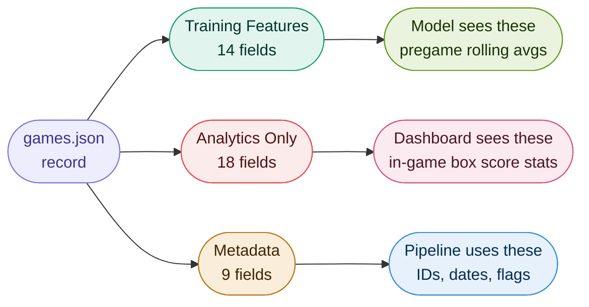
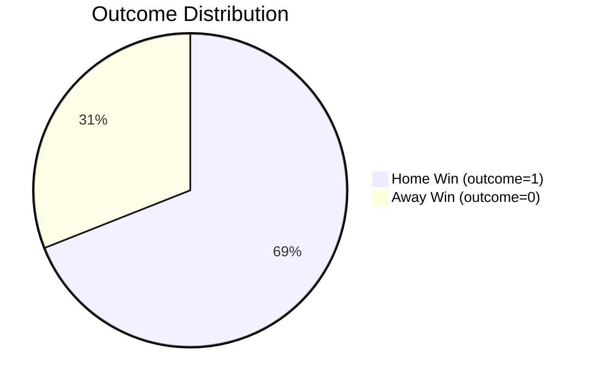
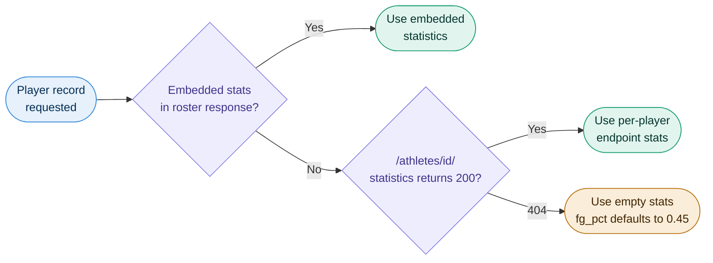

# Variable List


Complete reference for every feature, config key, API field, and runtime variable in the system. Version 2.5.1.

---

## Table of Contents

1. [Game Features (Model Input)](#1-game-features-model-input)
2. [Target Variable](#2-target-variable)
3. [Game Metadata Fields](#3-game-metadata-fields)
4. [Analytics-Only Fields](#4-analytics-only-fields)
5. [Team Stats Fields (Dashboard)](#5-team-stats-fields-dashboard)
6. [Player Stats Fields (Roster)](#6-player-stats-fields-roster)
7. [Roster Cache Fields](#7-roster-cache-fields)
8. [Model Metrics](#8-model-metrics)
9. [Registry Entry Fields](#9-registry-entry-fields)
10. [Learning Log Entry Fields](#10-learning-log-entry-fields)
11. [Config Keys (config.yaml)](#11-config-keys-configyaml)
12. [Environment Variables](#12-environment-variables)
13. [API Response Fields](#13-api-response-fields)
14. [CLI Arguments](#14-cli-arguments)
15. [Runtime State Variables](#15-runtime-state-variables)

---

## How the Fields Are Organised

Every game record in `games.json` contains three distinct layers of fields. Understanding which layer is which is the key to understanding the whole system.



---

## 1. Game Features (Model Input)


These 14 fields form the feature matrix **X** passed to every model. Order is fixed by `config.yaml -> data.features`. All are continuous floating-point values.

> **Critical v2.5 change:** These fields now store pre-game rolling averages, not in-game box score statistics. `home_fg_pct = 0.47` means "this team averaged 47% FG over their last 10 games going into this game." In v2.4 it meant "what they shot during this game" which is the outcome, not a predictor.

| Variable | Type | Description | Typical Range |
|----------|------|-------------|---------------|
| `home_fg_pct` | float | Rolling avg field goal percentage for the team in the home slot | 0.40 - 0.52 |
| `away_fg_pct` | float | Rolling avg field goal percentage for the team in the away slot | 0.40 - 0.52 |
| `home_rebounds` | float | Rolling avg total rebounds per game | 30 - 42 |
| `away_rebounds` | float | Rolling avg total rebounds per game | 30 - 42 |
| `home_assists` | float | Rolling avg assists per game | 11 - 18 |
| `away_assists` | float | Rolling avg assists per game | 11 - 18 |
| `home_turnovers` | float | Rolling avg turnovers committed per game | 10 - 16 |
| `away_turnovers` | float | Rolling avg turnovers committed per game | 10 - 16 |
| `home_steals` | float | Rolling avg steals per game | 4 - 10 |
| `away_steals` | float | Rolling avg steals per game | 4 - 10 |
| `home_blocks` | float | Rolling avg blocks per game | 2 - 8 |
| `away_blocks` | float | Rolling avg blocks per game | 2 - 8 |
| `home_ast_to_tov` | float | Rolling avg assists divided by rolling avg turnovers | 0.6 - 2.0 |
| `away_ast_to_tov` | float | Rolling avg assists divided by rolling avg turnovers | 0.6 - 2.0 |

**Note on `ast_to_tov`:** Computed as `rolling_avg(assists) / rolling_avg(turnovers)`, not as an average of per-game ratios. The ratio of averages is more numerically stable and avoids outliers from single games with very low turnover counts.

**What was removed in v2.5 and why:**

| Removed Field | Reason |
|---------------|--------|
| `home_ppg` |  Points scored in this game. That is what we are predicting. |
| `away_ppg` |  Same reason. |
| `home_eff_score` |  `home_score x home_fg_pct`. Downstream of the outcome. |
| `away_eff_score` |  Same reason. |

---

## 2. Target Variable


| Variable | Type | Values | Description |
|----------|------|--------|-------------|
| `outcome` | int | `1` or `0` | 1 = Home Win, 0 = Away Win |

```python
outcome = 1 if home_score > away_score else 0
```

Games where both scores are 0 are discarded. These indicate a game not yet played or an ESPN parse failure.

**Class distribution across 3 seasons (~2900 games):**



~69% home wins. This is why accuracy is a misleading metric here. A model that always predicts "Home Win" scores 69% accuracy but ROC-AUC of 0.5. The system selects models by ROC-AUC, not accuracy.

---

## 3. Game Metadata Fields


Stored in `data/games.json` alongside features. Not used as model inputs.

| Field | Type | Description |
|-------|------|-------------|
| `game_id` | string | Unique identifier. Format: `ESPN_<event_id>` for real games, `SYN_<n>` for synthetic. Used for deduplication in `append_to_json`. |
| `game_date` | string | Date played, YYYY-MM-DD. Extracted from ESPN event ISO string. Required for correct chronological ordering in the enrichment step. |
| `home_team` | string | Full team display name from ESPN, e.g. "Duke Blue Devils" |
| `away_team` | string | Full team display name from ESPN |
| `home_score` | int | Final score of the home team |
| `away_score` | int | Final score of the away team |
| `source` | string | `"espn"`, `"custom"`, or `"synthetic"` |
| `fetched_at` | string | ISO 8601 timestamp of when the record was fetched |
| `pregame_enriched` | bool | `True` if feature fields hold rolling averages. `False` if they still hold in-game stats. Training filters to `True` only. |
| `pregame_window_used` | int | Effective window for this record: `min(home_history_len, away_history_len, configured_window)`. Present only when `pregame_enriched=True`. |

---

## 4. Analytics-Only Fields


These fields are stored in `games.json` but are **never** in the training feature vector. They exist only for analytics display in the dashboard.

| Field | Type | Description | Why excluded |
|-------|------|-------------|--------------|
| `home_ppg` | float | Points scored by the home team in this game | This is the score. Using the score to predict the score is circular. |
| `away_ppg` | float | Points scored by the away team | Same. |
| `home_eff_score` | float | `home_score x home_fg_pct` | Derived from the score, therefore also leakage. |
| `away_eff_score` | float | `away_score x away_fg_pct` | Same. |
| `home_game_fg_pct` | float | Original in-game FG% before enrichment replaced the feature field | The corresponding feature field now holds the rolling average. |
| `away_game_fg_pct` | float | Original in-game FG% | Same. |
| `home_game_rebounds` | float | Original in-game rebounds | Same. |
| `away_game_rebounds` | float | Original in-game rebounds | Same. |
| `home_game_assists` | float | Original in-game assists | Same. |
| `away_game_assists` | float | Original in-game assists | Same. |
| `home_game_turnovers` | float | Original in-game turnovers | Same. |
| `away_game_turnovers` | float | Original in-game turnovers | Same. |
| `home_game_steals` | float | Original in-game steals | Same. |
| `away_game_steals` | float | Original in-game steals | Same. |
| `home_game_blocks` | float | Original in-game blocks | Same. |
| `away_game_blocks` | float | Original in-game blocks | Same. |
| `home_game_ast_to_tov` | float | Original in-game ast/tov ratio | Same. |
| `away_game_ast_to_tov` | float | Original in-game ast/tov ratio | Same. |

---

## 5. Team Stats Fields (Dashboard)


Returned by `/teams` and `/team_stats/<name>`. Computed by `build_team_stats(data, window)` in `app/preprocessing.py`. Both endpoints accept `?window=N`. When omitted, all games in the dataset are used.

> Since game records already store pre-game rolling averages as feature values, these aggregations are an average of averages. This is intentional. The result is a stable season-form estimate suitable for pre-filling the prediction form.

| Field | Type | Description |
|-------|------|-------------|
| `name` | string | Team display name |
| `home_fg_pct` | float | Average of the pre-game rolling avg FG% across all games, regardless of home or away side |
| `away_fg_pct` | float | Average of the opponent rolling avg FG% across all games |
| `home_rebounds` | float | Average of the pre-game rolling avg rebounds |
| `away_rebounds` | float | Opponent average rebounds |
| `home_assists` | float | Average of the pre-game rolling avg assists |
| `away_assists` | float | Opponent average assists |
| `home_turnovers` | float | Average of the pre-game rolling avg turnovers |
| `away_turnovers` | float | Opponent average turnovers |
| `home_steals` | float | Average of the pre-game rolling avg steals |
| `away_steals` | float | Opponent average steals |
| `home_blocks` | float | Average of the pre-game rolling avg blocks |
| `away_blocks` | float | Opponent average blocks |
| `home_ast_to_tov` | float | Average of the pre-game rolling avg ast/tov ratio |
| `away_ast_to_tov` | float | Opponent average ast/tov ratio |
| `games_played` | int | Total games this team appears in (not windowed) |
| `games_in_window` | int | Games used for the averages above (equals `games_played` when no window is set) |
| `wins` | int | Total wins across all games (not windowed) |

**Why the `home_*` / `away_*` naming?** The feature names match the model's training columns. When a team fills the home slot in a prediction, their stats go into `home_*` fields. The naming is positional (home slot vs away slot in the matchup), not directional (home venue vs away venue).

---

## 6. Player Stats Fields (Roster)


Individual player records. Also the format expected by `/predict/from_roster`.

| Field | Type | Description | Typical Range |
|-------|------|-------------|---------------|
| `id` | string | ESPN athlete ID | - |
| `name` | string | Player full display name | - |
| `position` | string | Position abbreviation (C, G, F) | - |
| `jersey` | string | Jersey number as string | - |
| `ppg` | float | Points per game (season average) | 0 - 35 |
| `rpg` | float | Rebounds per game | 0 - 15 |
| `apg` | float | Assists per game | 0 - 12 |
| `spg` | float | Steals per game | 0 - 4 |
| `bpg` | float | Blocks per game | 0 - 4 |
| `tov` | float | Turnovers per game | 0 - 6 |
| `fg_pct` | float | Field goal percentage as decimal. Defaults to 0.45 if unavailable. | 0.20 - 0.75 |
| `fgm` | float | Field goals made per game | 0 - 15 |
| `fga` | float | Field goals attempted per game | 0 - 25 |

**Stat extraction priority:**



**Aggregation into team features** (`compute_stats_from_roster(players, side)`):

| Team Feature | Aggregation Method | Why |
|---|---|---|
| `{side}_fg_pct` | `sum(fgm) / sum(fga)` if `sum(fga) > 0`, else `mean(fg_pct)` | FGA-weighted is more accurate than a simple mean when players have unequal shot volume |
| `{side}_rebounds` | `sum(rpg)` | Team total |
| `{side}_assists` | `sum(apg)` | Team total |
| `{side}_steals` | `sum(spg)` | Team total |
| `{side}_blocks` | `sum(bpg)` | Team total |
| `{side}_turnovers` | `sum(tov)` | Team total |
| `{side}_ast_to_tov` | `sum(apg) / sum(tov)` | Computed from totals, not averaged from per-player ratios |

Player season stats are pre-game information by nature. No leakage in roster mode.

---

## 7. Roster Cache Fields


| Field | Type | Description |
|-------|------|-------------|
| `team_name` | string | ESPN display name |
| `team_id` | string | ESPN internal team ID |
| `players` | list | Player objects (see Section 6) |
| `fetched_at` | string | ISO 8601. Cache is valid for `roster.cache_ttl_hours` (default 24h). |

**Team ID cache** (`data/team_ids.json`): flat dict mapping `{display_name: espn_id}`. Built on first lookup from `GET /teams?limit=1000`. Lookup tries exact match first, then case-insensitive substring match.

---

## 8. Model Metrics


| Metric | Type | Range | Description |
|--------|------|-------|-------------|
| `accuracy` | float | 0 - 1 | (TP + TN) / total |
| `precision` | float | 0 - 1 | TP / (TP + FP) |
| `recall` | float | 0 - 1 | TP / (TP + FN) |
| `f1` | float | 0 - 1 | Harmonic mean of precision and recall |
| `roc_auc` | float | 0 - 1 | Area under ROC curve. Primary selection metric. |
| `cv_roc_auc_mean` | float | 0 - 1 | Mean ROC-AUC across 5 CV folds |
| `cv_roc_auc_std` | float | 0 - 1 | Standard deviation of CV ROC-AUC scores |
| `confusion_matrix` | list | - | `[[TN, FP], [FN, TP]]` |
| `feature_importances` | dict | - | `{feature_name: importance}` for tree models and SVM. Null for MLP. |

**AUC sanity bands used at training time:**

| AUC Range | Status | Meaning |
|-----------|--------|---------|
|  | Suspicious | Possible leakage. Are all records enriched? |
|  | Healthy | Honest pre-game predictive range. |
|  | Too weak | Barely above chance. Fetch more data. |

**TP/TN/FP/FN defined relative to the positive class (Home Win = 1):**
- TP: predicted Home Win, actual Home Win
- TN: predicted Away Win, actual Away Win
- FP: predicted Home Win, actual Away Win
- FN: predicted Away Win, actual Home Win

---

## 9. Registry Entry Fields


Each version entry:

| Field | Type | Description |
|-------|------|-------------|
| `version` | string | "v1", "v2", etc. Auto-incremented. |
| `model_name` | string | "Gradient Boosting", "Neural Network (MLP)", etc. |
| `filename` | string | `.pkl` filename including version and first 8 chars of MD5 hash |
| `metrics` | dict | All model metrics (see Section 8) |
| `feature_names` | list | Ordered feature list this model was trained on. Stored with the model to prevent silent mismatches if the feature list changes between versions. |
| `training_size` | int | Number of samples in the training set |
| `trained_at` | string | ISO 8601 timestamp |
| `hash` | string | First 8 hex chars of MD5 of the serialized model object |

Top-level registry fields:

| Field | Type | Description |
|-------|------|-------------|
| `active_version` | string | Version currently served by `/predict` |
| `versions` | list | All version entries, oldest first. Pruned to `keep_top_n` (default 10). |

---

## 10. Learning Log Entry Fields


| Field | Type | Present when | Description |
|-------|------|-------------|-------------|
| `timestamp` | string | Always | ISO 8601 |
| `triggered_by` | string | Always | `"manual"`, `"new_data"`, `"scheduler"`, or `"manual_trigger"` |
| `result` | string | Always | `"promoted"` or `"skipped"` |
| `version` | string | Promoted | Registry version assigned |
| `model_name` | string | Promoted | Name of the promoted model |
| `roc_auc` | float | Promoted | ROC-AUC of the promoted model |
| `f1` | float | Promoted | F1 score |
| `accuracy` | float | Promoted | Accuracy |
| `dataset_size` | int | Always | Total games in dataset at training time |
| `reason` | string | Skipped | Why promotion was skipped |
| `new_auc` | float | Skipped | ROC-AUC of the candidate that was not promoted |
| `current_auc` | float | Skipped | ROC-AUC of the model that was kept |
| `best_model` | string | Skipped | Name of the candidate that lost |

---

## 11. Config Keys (config.yaml)


### app

| Key | Type | Default | Description |
|-----|------|---------|-------------|
| `app.name` | string | "Basketball Game Outcome Predictor" | Display name |
| `app.version` | string | "2.5.1" | App version string |
| `app.debug` | bool | false | Flask debug mode |
| `app.port` | int | 5000 | Flask server port. Overridden by `PORT` env var on cloud platforms. |
| `app.host` | string | "0.0.0.0" | Flask bind address |

### home_team

| Key | Type | Description |
|-----|------|-------------|
| `home_team.name` | string | Home team display name. Must match ESPN `displayName` exactly. |
| `home_team.espn_id` | string | ESPN team ID used for direct team lookups |
| `home_team.court_name` | string | Arena name |

### data

| Key | Type | Default | Description |
|-----|------|---------|-------------|
| `data.dir` | string | "data" | Directory for data files |
| `data.local_file` | string | "data/games.json" | Path to local game records |
| `data.test_size` | float | 0.2 | Fraction held out for testing |
| `data.random_state` | int | 42 | Seed for reproducibility |
| `data.min_games_required` | int | 50 | Minimum records before training is attempted |
| `data.features` | list | See Section 1 | Ordered feature column names. 14 features. |
| `data.label` | string | "outcome" | Target column name |
| `data.pregame_window` | int | 10 | Prior games to average for pre-game features |
| `data.pregame_min_games` | int | 1 | Min prior games before a record is training-eligible |
| `data.leakage_correlation_threshold` | float | 0.70 | Feature-outcome correlation above this triggers a warning |

### ncaa_api

| Key | Type | Default | Description |
|-----|------|---------|-------------|
| `ncaa_api.provider` | string | "espn" | `"espn"` or `"custom"` |
| `ncaa_api.season` | int | 2024 | Legacy single-season fallback |
| `ncaa_api.seasons` | list | [2022, 2023, 2024] | All seasons to fetch |
| `ncaa_api.max_games` | int | 3000 | Total game cap across all seasons |
| `ncaa_api.rate_limit_delay` | float | 0.4 | Seconds between ESPN requests |
| `ncaa_api.espn.base_url` | string | ESPN API base | Base URL |
| `ncaa_api.espn.scoreboard_path` | string | "/scoreboard" | Daily game IDs |
| `ncaa_api.espn.summary_path` | string | "/summary" | Box score details |
| `ncaa_api.espn.teams_path` | string | "/teams" | Team list and roster lookups |
| `ncaa_api.espn.athletes_path` | string | "/athletes" | Per-player statistics fallback |
| `ncaa_api.espn.page_size` | int | 25 | Games per scoreboard request |
| `ncaa_api.custom.base_url` | string | "" | Custom API provider base URL |
| `ncaa_api.custom.api_key` | string | "" | API key, or use `NCAA_API_KEY` env var |
| `ncaa_api.custom.field_map` | dict | - | Maps internal field names to provider field names |

### snowflake

| Key | Type | Default | Description |
|-----|------|---------|-------------|
| `snowflake.enabled` | bool | false | Enable Snowflake storage |
| `snowflake.user` | string | "" | Set via `SNOWFLAKE_USER` env var |
| `snowflake.password` | string | "" | Set via `SNOWFLAKE_PASSWORD` env var |
| `snowflake.account` | string | "" | Snowflake account identifier |
| `snowflake.warehouse` | string | "" | Compute warehouse |
| `snowflake.database` | string | "" | Database |
| `snowflake.schema` | string | "" | Schema |
| `snowflake.table` | string | "BASKETBALL_GAMES" | Table name |

### models

| Key | Type | Default | Description |
|-----|------|---------|-------------|
| `models.dir` | string | "models" | Directory for model files |
| `models.registry_file` | string | "models/registry.json" | Version registry path |
| `models.selection_metric` | string | "roc_auc" | Metric used to pick best model |
| `models.keep_top_n` | int | 10 | Max versions before oldest are pruned from disk |
| `models.enabled` | list | All 5 plus XGBoost | Models included each training run |

**Per-model hyperparameters (v2.5.1 defaults after fairness restoration):**

| Model | Key | Default | Change from v2.4 |
|-------|-----|---------|-----------------|
| gradient_boosting | n_estimators | 300 | Raised from 200 |
| gradient_boosting | learning_rate | 0.05 | Unchanged |
| gradient_boosting | max_depth | 4 | Further capped by adaptive_depth at runtime |
| gradient_boosting | subsample | 0.8 | Unchanged |
| gradient_boosting | min_samples_split | 5 | Restored from 10 |
| gradient_boosting | min_samples_leaf | 2 | Added explicitly |
| random_forest | n_estimators | 300 | Raised from 200 |
| random_forest | max_depth | 10 | Adaptive ceiling is 4 at current dataset size |
| random_forest | min_samples_split | 5 | Restored from 10 |
| random_forest | min_samples_leaf | 2 | Restored from 4 |
| extra_trees | n_estimators | 300 | Raised from 200 |
| extra_trees | max_depth | 10 | Adaptive ceiling applies |
| extra_trees | min_samples_split | 5 | Restored from 10 |
| extra_trees | min_samples_leaf | 2 | Restored from 4 |
| svm | kernel | "rbf" | Unchanged |
| svm | C | 2.0 | Raised from 1.0 |
| svm | gamma | "scale" | Unchanged |
| mlp | hidden_layer_sizes | [128, 64, 32] | Restored from [64, 32] |
| mlp | activation | "relu" | Unchanged |
| mlp | max_iter | 500 | Unchanged |
| mlp | early_stopping | true | Unchanged |
| mlp | validation_fraction | 0.15 | Unchanged |
| xgboost | n_estimators | 300 | Raised from 200 |
| xgboost | learning_rate | 0.05 | Unchanged |
| xgboost | max_depth | 5 | Raised from 4 |
| xgboost | subsample | 0.8 | Unchanged |
| xgboost | colsample_bytree | 0.8 | Unchanged |
| xgboost | min_child_weight | 3 | Added in v2.5.1 |

All models also accept `random_state: 42`.

### auto_learn

| Key | Type | Default | Description |
|-----|------|---------|-------------|
| `auto_learn.enabled` | bool | true | Start scheduler on `--serve` |
| `auto_learn.fetch_interval_hours` | int | 6 | Hours between fetch attempts |
| `auto_learn.retrain_interval_hours` | int | 24 | Hours between forced retrains |
| `auto_learn.min_new_games_to_retrain` | int | 15 | New games required to trigger immediate retrain |
| `auto_learn.promote_threshold` | float | 0.002 | Minimum AUC improvement required to promote |
| `auto_learn.learning_log_file` | string | "data/learning_log.json" | Path to training history log |

### roster

| Key | Type | Default | Description |
|-----|------|---------|-------------|
| `roster.cache_dir` | string | "data/rosters" | Per-team roster cache directory |
| `roster.cache_ttl_hours` | int | 24 | Cache validity window in hours |
| `roster.team_id_cache` | string | "data/team_ids.json" | ESPN name-to-ID lookup cache |

### rolling

| Key | Type | Default | Description |
|-----|------|---------|-------------|
| `rolling.available_windows` | list | [5, 10, 15, 20] | Window sizes available in the dashboard rolling selector |
| `rolling.default_window` | int | 12 | Default window when no selection is made |

---

## 12. Environment Variables


| Variable | Used by | Description |
|----------|---------|-------------|
| `SNOWFLAKE_USER` | `_sf_conn()` | Snowflake username. Overrides `snowflake.user` in config. |
| `SNOWFLAKE_PASSWORD` | `_sf_conn()` | Snowflake password. |
| `NCAA_API_KEY` | `CustomAPIFetcher` | API key for custom data provider. |
| `PORT` | `main.py --serve` | Server port injected by cloud platforms (Render, Railway). Falls back to `app.port` in config. |

**Setting env vars:**

```bash
# macOS / Linux
export SNOWFLAKE_USER=youruser
export SNOWFLAKE_PASSWORD=yourpassword

# Windows PowerShell
$env:SNOWFLAKE_USER = "youruser"
$env:SNOWFLAKE_PASSWORD = "yourpassword"
```

---

## 13. API Response Fields


### POST /predict

Request body: all 14 feature fields, names matching `feature_names` in the active model's registry entry.

| Response Field | Type | Description |
|----------------|------|-------------|
| `prediction` | string | "Home Win" or "Away Win" |
| `prediction_value` | int | 1 or 0 |
| `confidence` | float or null | `max(predict_proba)`, range 0.5 to 1.0 |
| `model_name` | string | Name of the active model |
| `version` | string | Registry version |

### POST /predict/from_roster

| Response Field | Type | Description |
|----------------|------|-------------|
| `prediction` | string | "Home Win" or "Away Win" |
| `prediction_value` | int | 1 or 0 |
| `confidence` | float or null | `max(predict_proba)` |
| `model_name` | string | Active model name |
| `version` | string | Registry version |
| `computed_stats` | dict | The 14 model features actually used, aggregated from player selections |
| `insights` | dict | `insight_*` fields: ppg totals, eff_score, scoring_dominance, depth_signal, role_balance, efficiency_spread |
| `home_count` | int | Number of home players selected |
| `away_count` | int | Number of away players selected |

### GET /analytics

| Response Field | Type | Description |
|----------------|------|-------------|
| `total_games` | int | Total records in games.json |
| `home_wins` | int | Records with outcome == 1 |
| `away_wins` | int | Records with outcome == 0 |
| `home_win_rate` | float | home_wins / total_games |
| `enriched_games` | int | Records with pregame_enriched == True |
| `enrichment_rate` | float | enriched_games / total_games |
| `feature_stats` | dict | `{home_win: {feature: avg}, away_win: {feature: avg}}` |
| `model_comparison` | dict | `{model_name: {accuracy, precision, recall, f1, roc_auc, ...}}` |
| `feature_importances` | dict | `{model_name: {feature: importance}}` |
| `data_sources` | dict | `{source_name: count}` |

### GET /debug

| Response Field | Type | Description |
|----------------|------|-------------|
| `game_count` | int | Total game records |
| `enriched_count` | int | Records with pregame_enriched == True |
| `enrichment_rate` | string | Percentage string, e.g. "96.5%" |
| `active_model` | string or null | Active model name |
| `active_version` | string or null | Active version |
| `configured_seasons` | list | Seasons list from config |
| `max_games_cap` | int | max_games from config |
| `pregame_window` | int | pregame_window from config |
| `training_features` | list | Feature names from config |
| `cwd` | string | Current working directory |

### GET /roster/\<team_name\>

| Response Field | Type | Description |
|----------------|------|-------------|
| `status` | string | `"loading"`, `"ready"`, `"error"`, or `"not_started"` |
| `players` | list | Players fetched so far |
| `done` | int | Players whose stats have been resolved |
| `total` | int | Total players on roster |
| `message` | string | Present only when status == "error" |

### GET /autolearn/status

| Response Field | Type | Description |
|----------------|------|-------------|
| `enabled` | bool | Whether scheduler is enabled in config |
| `status` | string | `"idle"`, `"fetching"`, or `"training"` |
| `fetch_interval_h` | int | Hours between fetches |
| `retrain_interval_h` | int | Hours between forced retrains |
| `min_new_games` | int | Threshold for immediate retrain |
| `promote_threshold` | float | Required AUC improvement |
| `next_fetch_in` | string | Countdown, e.g. "5h 42m" |
| `next_retrain_in` | string | Countdown |
| `last_fetch` | string or null | ISO 8601, null if never fetched |
| `last_retrain` | string or null | ISO 8601, null if never retrained |

---

## 14. CLI Arguments


| Argument | Type | Description |
|----------|------|-------------|
| `--fetch` | flag | Fetch real NCAA games from ESPN across all configured seasons |
| `--enrich` | flag | Back-fill pre-game rolling averages into an existing games.json. Run once after upgrading to v2.5, then retrain. |
| `--fetch-rosters` | flag | Pre-fetch and cache rosters for every team in the dataset. Blocking. |
| `--generate-synthetic` | flag | Generate synthetic games as an offline fallback |
| `--train` | flag | Train all enabled models, register best by selection metric |
| `--serve` | flag | Start Flask server and auto-learn scheduler |
| `--list-models` | flag | Print table of all registered versions with metrics |
| `--activate` | string | Version to promote, e.g. `--activate v2` |
| `--storage` | choice | `"local"` (default) or `"snowflake"` |
| `--config` | string | Path to config file (default: config.yaml) |
| `--max-games` | int | Override config max_games cap for one fetch run |

---

## 15. Runtime State Variables


Module-level variables that live in memory for the duration of the server process.

| Variable | Module | Type | Description |
|----------|--------|------|-------------|
| `_roster_progress` | `app/roster.py` | `dict[str, dict]` | Shared state between Flask request threads and RosterFetcher background threads. Keyed by team display name. Written by fetch threads, read by `/roster/progress/` and `/roster/` endpoints. |
| `_scheduler` | `app/api.py` | `AutoLearnScheduler` | The singleton scheduler instance. Started by `main.py --serve`. Exposes `get_state()` and `stop()`. |

---

*All types reflect Python runtime values. Floats in JSON responses are rounded to 4 decimal places. Null values appear as JSON `null` and Python `None`. Config defaults above reflect v2.5.1.*
