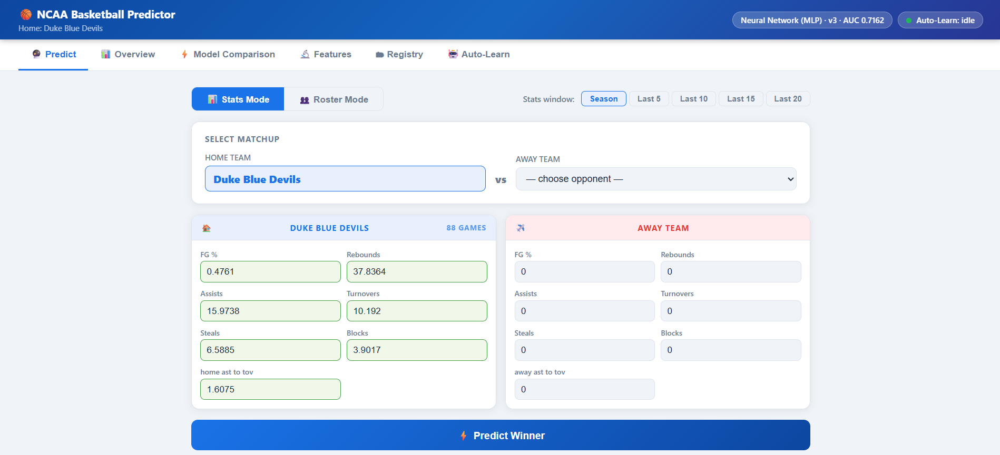

> Please read [LICENSE](https://github.com/Codex-Crusader/Uni-basketball-ETL-pipeline/blob/main/LICENSE) and [DISCLAIMER.md](https://github.com/Codex-Crusader/Uni-basketball-ETL-pipeline/blob/main/DISCLAIMER.md) before using this project.

# NCAA Basketball Outcome Predictor [](https://uni-basketball-etl-pipeline.onrender.com/)
Note: Live demo uses Synthetic data.

> *An end-to-end machine learning pipeline demonstrating production-ready ML engineering practices*

[](https://www.python.org/)
[](https://flask.palletsprojects.com/)

[](https://scikit-learn.org/)


## Preview



### More screenshots below

<details>
<summary>Expand</summary>


</details>

---

## Overview

This project implements a complete machine learning system for predicting NCAA basketball game outcomes (Home Win vs Away Win). The focus is on ML engineering best practices: building a maintainable, self-improving system rather than just training a model once.

### What This Project Demonstrates

- Real NCAA data via ESPN's unofficial API (no key required), across three seasons
- Script-based ML workflow with no Jupyter notebooks
- SQL database storage (Snowflake provisioned; local JSON for development)
- 5-model automated comparison (plus optional XGBoost as a sixth) with ROC-AUC selection and 5-fold cross-validation
- Pre-game rolling average enrichment eliminating data leakage from in-game stats
- Model versioning registry with rollback support
- Auto-learning scheduler that fetches, retrains, and promotes improvements automatically
- Home-team-centric predictions with season-average auto-fill and rolling window selector
- Roster-based predictions using individual player season averages
- Interactive multi-tab dashboard for predictions, analytics, model history, and roster management
- Config-driven modular architecture with structured logging

---

## Problem Statement

NCAA programs need quick, data-driven pre-game predictions to support decision-making. This system provides:

1. A reproducible, automated training pipeline trained on honest pre-game data
2. Five-model comparison (six with XGBoost) with automatic best-model selection
3. An easy-to-use prediction interface with team stats auto-filled from historical averages
4. Roster-mode predictions built from individual player season averages
5. Continuous self-improvement as new game data arrives
6. Full analytics dashboard including feature importance and model progression over time

**Key Focus:** Engineering a system that improves itself over time on data it could realistically have had before each game — not post-game box scores.

---

## Architecture

```
Uni-basketball-ETL-pipeline/
    ├──main.py               CLI entry point (~200 lines)
    ├──config.yaml           All settings, no hardcoded values
    ├──dashboard.html        Frontend: all tabs, charts, team picker
    ├──requirements.txt
    ├──DISCLAIMER.md
    ├──data/
    │    ├──games.json        ESPN game records with pre-game features
    │    ├──app.log           Rotating log (10 MB x 2 backups = 30 MB ceiling)
    │    ├──learning_log.json Auto-learn history
    │    ├──team_ids.json     ESPN team name to ID cache
    │    └──rosters/          Per-team roster cache
    ├──models/
    │    ├──registry.json     Version index and metrics
    │    ├──latest_comparison.json
    │    └──*.pkl             Versioned model files
    ├──app/
    │    ├──__init__.py
    │    ├──config.py         Config loading, all CFG constants, Path constants
    │    ├──logger.py         RotatingFileHandler setup, get_logger()
    │    ├──storage.py        JSON and Snowflake I/O, _sanitize()
    │    ├──enrichment.py     Pre-game rolling average pipeline
    │    ├──fetcher.py        ESPNFetcher, multi-season fetch
    │    ├──roster.py         RosterFetcher, player stat aggregation
    │    ├──preprocessing.py  Validation, adaptive depth, prepare_data, team stats
    │    ├──models.py         Registry, build_models, train_and_evaluate
    │    ├──scheduler.py      AutoLearnScheduler background thread
    │    └──api.py            Flask app and all routes
    └──docs/
         ├──Future_dev_map.md Future plans regarding repository
         ├──changelog.md
         ├──code_flow.md      Explaination of code  
         ├──math.md           Explaination of mathamatics used in code 
         └──variable_list.md  List of variables

```

### Module Dependency Order

No circular imports. Each module only imports from modules above it in this chain:

```
config.py
    logger.py
        storage.py
            enrichment.py
                fetcher.py
                roster.py
                preprocessing.py
                    models.py
                        scheduler.py
                            api.py
                                main.py
```

### Logging

All `print()` calls have been replaced with the Python `logging` module.

- Console: INFO and above — clean operational output
- File (`data/app.log`): DEBUG and above — everything including verbose fetch progress
- Rotation: 10 MB per file, 2 backups retained (30 MB ceiling total)
- Format: `2024-01-15 19:00:01  INFO  bball.app.fetcher  [ESPN] Season 2022-23 done.`

---

## The Leakage Problem and the Fix

### What Was Wrong (v2.4 and earlier)

The original feature fields stored in-game box score statistics. When `home_fg_pct = 0.52` meant "what this team shot during the game," the model learned "teams that shot well won" — which is circular. The model was describing outcomes rather than predicting them. AUC of 0.9666 was not impressive; it was a red flag.

### The Fix (v2.5)

Every game record now stores **pre-game rolling averages** in the feature fields. When `home_fg_pct = 0.47`, it means "what this team averaged over their last 10 games going into tonight." That is knowable before tipoff. That is actual prediction.

The original in-game stats are preserved under `home_game_*` / `away_game_*` keys for analytics display. They are simply no longer part of the training feature vector.

The enrichment pipeline (`enrich_with_pregame_averages`) sorts all games chronologically by `game_date`, builds a rolling history per team, and for each game overwrites the feature fields with that team's prior-game averages. A game where either team has no prior history is excluded from training (cold-start exclusion).

**AUC before fix: 0.9666 (leakage)**
**AUC after fix: ~0.74 (honest pre-game prediction)**

The AUC went down. That is the right result.

---

## Machine Learning Models

The system trains and compares five models every run, with an optional sixth:

| Model | Notes |
|-------|-------|
| Gradient Boosting | Sequential trees, strong on tabular data |
| Random Forest | Parallel ensemble, reliable feature importances |
| Extra Trees | Extra randomness reduces overfitting on smaller sets |
| SVM (RBF kernel) | Strong margin classifier, needs StandardScaler |
| Neural Network (MLP) | 128 to 64 to 32, ReLU, early stopping |
| XGBoost (optional) | Install with `pip install xgboost` to enable |

All models are wrapped in a `StandardScaler -> estimator` Pipeline so scaling is handled correctly and consistently. The scaler is fit only on the training set — no leakage.

**Model Selection:** Best ROC-AUC from 5-fold cross-validation. Configurable in `config.yaml`.

**Adaptive depth:** Tree model `max_depth` is capped at `log2(n_samples / (10 * n_features))` to prevent overfitting on smaller datasets. At 2300 training samples with 14 features, the ceiling is depth 4 regardless of what is set in config.

---

## Features Used for Prediction

Each game is represented by **14 features**. As of v2.5, these are pre-game rolling averages, not in-game box scores.

| Feature | Description |
|---------|-------------|
| `home_fg_pct` / `away_fg_pct` | Rolling average field goal percentage (last 10 games) |
| `home_rebounds` / `away_rebounds` | Rolling average total rebounds |
| `home_assists` / `away_assists` | Rolling average assists |
| `home_turnovers` / `away_turnovers` | Rolling average turnovers |
| `home_steals` / `away_steals` | Rolling average steals |
| `home_blocks` / `away_blocks` | Rolling average blocks |
| `home_ast_to_tov` / `away_ast_to_tov` | Derived: rolling avg assists / rolling avg turnovers |

Fields that were removed from the feature vector (still stored in `games.json` for analytics):
- `home_ppg` / `away_ppg` — actual game score, not a pre-game stat
- `home_eff_score` / `away_eff_score` — derived from score, therefore also leakage

**Outcome:** Binary — `1` = Home Win, `0` = Away Win

---

## Installation and Setup

### Prerequisites

- Python 3.8+
- pip

### Installation

```bash
pip install -r requirements.txt
```

### Optional

```bash
pip install xgboost                        # adds a sixth model
pip install snowflake-connector-python     # only if using Snowflake
```

---

## Usage Guide

### First-time setup with existing data (upgrading from v2.4)

```bash
# If you already have a games.json from a previous version:
python main.py --enrich    # back-fill pre-game averages (takes ~2 seconds)
python main.py --train     # retrain on honest data
python main.py --serve
```

### Standard workflow from scratch

```bash
# Step 1: Fetch real NCAA data from ESPN (3 seasons, ~2900 games, takes 20-40 min)
python main.py --fetch

# If ESPN is slow or unavailable, use synthetic data instead:
python main.py --generate-synthetic

# Step 2: (Optional) Pre-fetch and cache rosters for all teams
python main.py --fetch-rosters

# Step 3: Train all models and register the best one
python main.py --train

# Step 4: Start the server
python main.py --serve
```

Open http://localhost:5000

---

### Full Command Reference

| Command | Description |
|---------|-------------|
| `--fetch` | Fetch real NCAA games from ESPN (all configured seasons) |
| `--enrich` | Back-fill pre-game rolling averages into existing games.json. Run once after upgrading to v2.5, then retrain. |
| `--fetch-rosters` | Pre-fetch and cache player rosters for all teams in the dataset |
| `--generate-synthetic` | Generate synthetic games as an offline fallback |
| `--train` | Train all models, register best by ROC-AUC |
| `--serve` | Start Flask server and auto-learn scheduler |
| `--list-models` | Print all registered model versions |
| `--activate v3` | Set a specific version as active |
| `--max-games N` | Override the config max_games cap for one fetch run |
| `--storage snowflake` | Use Snowflake instead of local JSON |

---

### Configuration

All settings live in `config.yaml`. Nothing is hardcoded in the Python source.

```yaml
home_team:
  name: "Duke Blue Devils"    # Your home team (must match ESPN display name)

data:
  pregame_window: 10          # Games to average for pre-game features
  pregame_min_games: 1        # Min prior games before a record is training-eligible

ncaa_api:
  seasons: [2022, 2023, 2024] # Multi-season fetch
  max_games: 3000             # Cap on total games fetched

auto_learn:
  enabled: true
  fetch_interval_hours: 6
  retrain_interval_hours: 24
  min_new_games_to_retrain: 15
  promote_threshold: 0.002    # Only promote if AUC improves by this much

models:
  selection_metric: "roc_auc"
  enabled:
    - gradient_boosting
    - random_forest
    - extra_trees
    - svm
    - mlp
    - xgboost                 # optional, skipped if not installed
```

Snowflake credentials are read from environment variables (`SNOWFLAKE_USER`, `SNOWFLAKE_PASSWORD`). Never hardcoded.

---

## Auto-Learning Pipeline

When `--serve` is running, a background daemon thread manages continuous improvement:

```
Every 6 hours:
    Fetch new games from ESPN
    Append unique games (deduplicated by game_id)
    Enrich new games with pre-game rolling averages
    If 15 or more new games added:
        Retrain all models
        If new best AUC > current AUC + 0.002:
            Register new version, promote to active
        Else:
            Log "skipped" with reason

Every 24 hours (regardless of new data):
    Force full retrain cycle
```

Every decision (promoted or skipped with reason) is written to `data/learning_log.json` and visible in the Auto-Learn tab of the dashboard.

---

## Roster System

The roster system allows predictions to be built from individual player selections rather than historical team averages. It uses ESPN endpoints to fetch player rosters and per-player season stats.

The fetch runs in a background thread. The dashboard polls for progress every second and renders players as they arrive. Player names appear immediately; stats fill in as the thread progresses.

Running `--fetch-rosters` before serving will populate the cache for all teams currently in the dataset, making roster lookups instant in the dashboard.

---

## Dashboard Tabs

### Predict
- Home team fixed from config, opponent chosen from dropdown
- Stats mode: stats auto-fill from season averages or rolling window
- Roster mode: select individual players, aggregate their season stats live before predicting
- Confidence percentage shown with result; computed team stats displayed showing exactly what the model used

### Overview
- Total games, home/away win rates, enrichment rate
- Outcome distribution chart
- Active model radar chart
- Model AUC over time (visual progression across all registered versions)

### Model Comparison
- All models side-by-side metrics table with inline bar charts
- Grouped bar chart (Accuracy / F1 / ROC-AUC)
- Multi-model radar chart

### Feature Analysis
- Average stats for home-win vs away-win games
- Per-model feature importance horizontal bar chart with model selector

### Registry
- All registered versions with metrics
- One-click Activate to promote any version
- Training size and timestamp per version

### Auto-Learn
- Scheduler status (idle / fetching / training) polled every 15 seconds
- Countdown to next fetch and retrain
- Full learning log table (promoted / skipped per run)
- Manual Trigger Retrain button

---

## API Endpoints

| Method | Endpoint | Description |
|--------|----------|-------------|
| GET | `/` | Dashboard |
| POST | `/predict` | Predict from raw feature values (stats mode) |
| POST | `/predict/from_roster` | Predict from selected player lists (roster mode) |
| GET | `/analytics` | Dataset stats, model comparison, enrichment rate |
| GET | `/model_info` | Active model metadata |
| GET | `/registry` | All registered versions |
| POST | `/registry/activate/<version>` | Promote a version |
| GET | `/teams` | All teams with season or rolling averages |
| GET | `/team_stats/<name>` | Stats for a specific team (fuzzy match, optional window) |
| GET | `/home_team` | Configured home team and stats |
| GET | `/roster/<team_name>` | Kick off async roster fetch; returns current progress |
| GET | `/roster/progress/<team_name>` | Poll roster fetch progress |
| POST | `/roster/refresh/<team_name>` | Force a fresh ESPN roster fetch |
| GET | `/autolearn/status` | Scheduler state and countdowns |
| POST | `/autolearn/trigger` | Manually trigger retrain |
| GET | `/learning_log` | Training history |
| GET | `/features` | Feature list and rolling window options from config |
| GET | `/debug` | Health check: paths, game count, enrichment rate, active model |

---

## Model Evaluation Metrics

| Metric | Definition |
|--------|------------|
| Accuracy | (TP + TN) / Total |
| Precision | TP / (TP + FP) |
| Recall | TP / (TP + FN) |
| F1-Score | 2 x (P x R) / (P + R) |
| ROC-AUC | Area under ROC curve — primary selection metric |
| CV ROC-AUC | 5-fold cross-validated AUC and standard deviation |

---

## Project Requirements Met

| Requirement | Status |
|-------------|--------|
| SQL database storage (Snowflake) | Done — provisioned, env-var credentials |
| Local development option | Done — JSON with full feature parity |
| Real data ingestion (multi-season) | Done — ESPN API, ~2900 games across 3 seasons |
| Multiple traditional ML models | Done — 5 models plus optional XGBoost |
| Training and evaluation pipeline | Done — with 5-fold CV |
| Automated model selection | Done — by ROC-AUC |
| Python scripts, no notebooks | Done |
| Command-line interface | Done |
| Model serialization and persistence | Done — versioned registry |
| Interactive web dashboard | Done — 6 tabs |
| Analytics visualizations | Done — charts, radar, importances |
| Model retraining workflow | Done — automated and manual |
| No hardcoded secrets | Done — environment variables |
| Data drift handling | Done — auto-learn with promote threshold |
| Roster-based predictions | Done — player selection, FGA-weighted aggregation |
| Structured logging | Done — rotating file handler, module-level loggers |
| Modular codebase | Done — app/ package, 10 modules, no circular imports |
| Pre-game features (no leakage) | Done — rolling averages, not in-game stats |

---

## Known Limitations

1. **ESPN unofficial API** — no SLA, could change structure without notice
2. **Rolling average cold-start** — each team's first game of the season is excluded from training because there is no prior history to average. With 3 seasons of data this affects a small fraction of records.
3. **Roster stats reliability** — embedded stats in the ESPN roster response are preferred; the per-player `/statistics` fallback endpoint returns 404 for many college players
4. **No SHAP values** — feature importances are raw impurity-based values, not Shapley values
5. **Single-instance Flask** — not production-hardened (no gunicorn, no auth)

---

## Technical Stack

| Layer | Technology |
|-------|-----------|
| Language | Python 3.8+ |
| ML | scikit-learn 1.8.0, XGBoost (optional) |
| Web server | Flask 3.1.2 |
| Numerical | NumPy 2.4.2 |
| Config | PyYAML 6.0.3 |
| Data fetch | requests 2.32.5 |
| Storage | Local JSON / Snowflake |
| Frontend | HTML5, Chart.js 4.4.2, vanilla JS |
| Logging | Python logging, RotatingFileHandler |

---

## Design Philosophy

### Engineering Over Accuracy

This project prioritizes system engineering over raw model performance. The goal is to demonstrate:

1. How to build a maintainable ML system
2. How to ensure features represent genuinely pre-game information
3. How to make models usable by non-programmers
4. How to support continuous improvement with new data

A model with AUC 0.74 on honest pre-game data is more defensible than a model with AUC 0.97 on data that leaks the answer. The drop in AUC from v2.4 to v2.5 is not a regression. It is the correct result.

**Lesson:** Real-world ML is 70% engineering, 30% modeling — and the 30% starts with making sure your features are actually predictive.

---

## Acknowledgments

Technologies used: scikit-learn, Flask, Snowflake, Chart.js, PyYAML, requests.

Inspired by real-world ML deployment challenges. Designed to bridge the gap between notebooks and production systems.

---
*Built with 🏀 and ☕ by a student who cares about code quality, not just accuracy metrics.*

**Last Updated:** March 2026  
**Python Version:** 3.8+  

**Status:** Ready for academic demonstration
