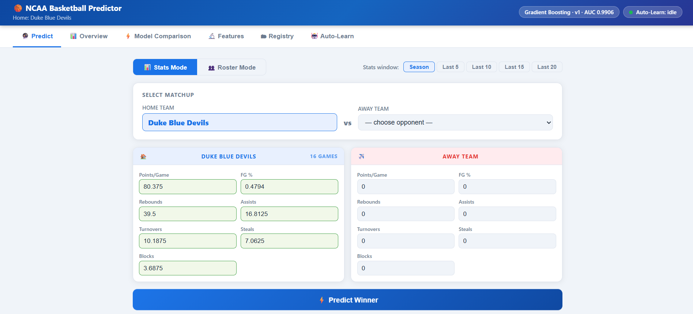
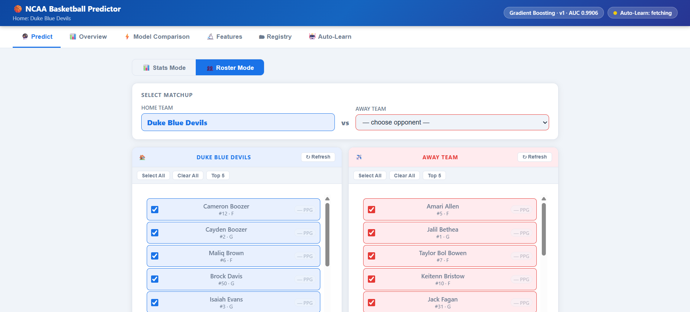
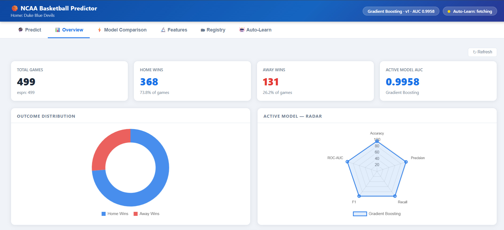
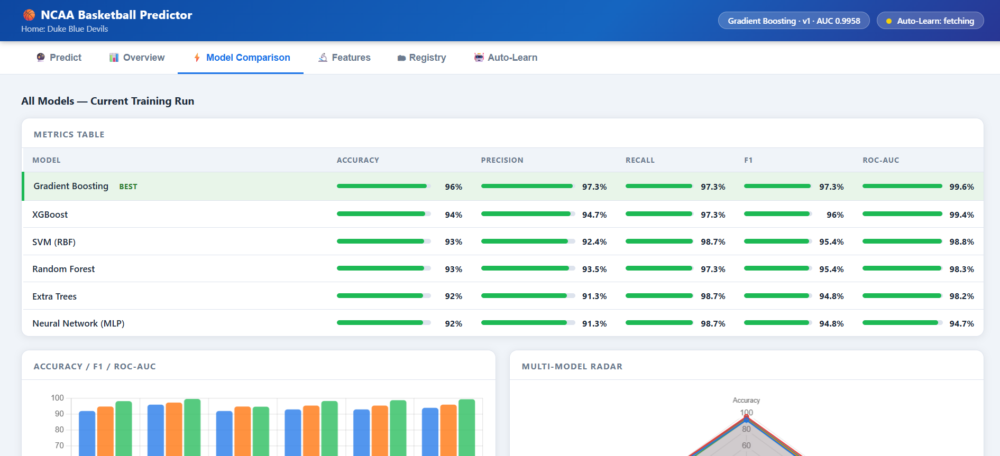
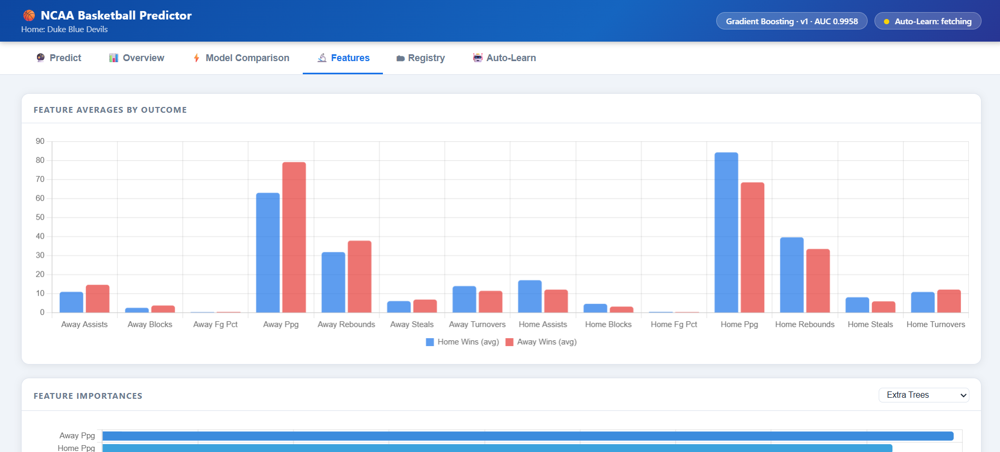
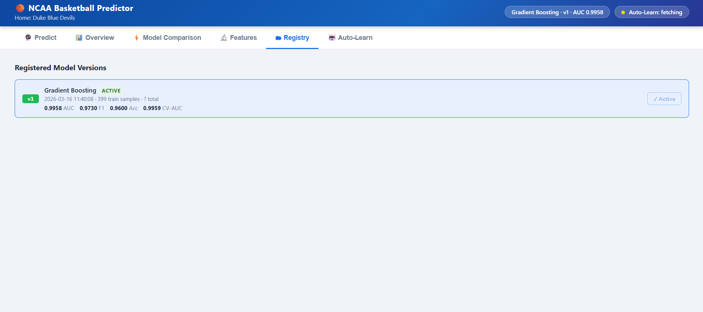
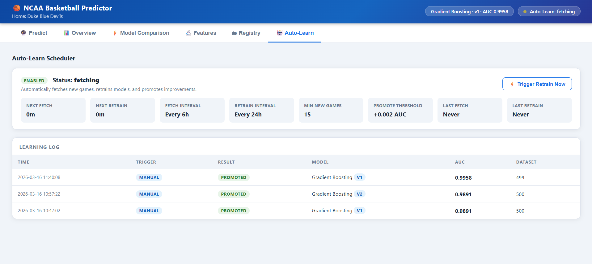

# 🏀 NCAA Basketball Outcome Predictor

> *An end-to-end machine learning pipeline demonstrating production-ready ML engineering practices*

[](https://www.python.org/)
[](https://flask.palletsprojects.com/)
[](https://scikit-learn.org/)


<details>
<summary>View Dashboard Screenshots</summary>








</details>

---

## 📋 Overview

This project implements a complete machine learning system for predicting NCAA basketball game outcomes (Home Win vs Away Win). The focus is on **ML engineering best practices** — building a maintainable, self-improving system rather than just training a model once and calling it done.

### What This Project Demonstrates

- **Real NCAA data** via ESPN's unofficial API (no key required)
- **Script-based ML workflow** (no Jupyter notebooks)
- **SQL database storage** (Snowflake provisioned; local JSON for development)
- **6-model automated comparison** with ROC-AUC selection and 5-fold cross-validation
- **Model versioning registry** with rollback support
- **Auto-learning scheduler** that fetches, retrains, and promotes improvements automatically
- **Home-team-centric predictions** with season-average auto-fill
- **Interactive multi-tab dashboard** for predictions, analytics, and model history
- **Config-driven architecture**, no hardcoded values anywhere

---

## 🎯 Problem Statement

NCAA programs need quick, data-driven predictions to support decision-making. This system provides:

1. A reproducible, automated training pipeline
2. Six-model comparison with automatic best-model selection
3. Easy-to-use prediction interface with team stats auto-filled
4. Continuous self-improvement as new game data arrives
5. Full analytics dashboard including feature importance and model progression over time

**Key Focus:** Engineering a system that improves itself over time, not just one that trains once.

---

## 🏗️ Architecture

```
┌─────────────────────────────────────────────────────────────┐
│                    Command Line Interface                    │
│                         (main.py)                            │
└────────────────────┬────────────────────────────────────────┘
                     │
        ┌────────────┼────────────┬─────────────┐
        │            │            │             │
        ▼            ▼            ▼             ▼
  [--fetch]  [--generate-  [--train]       [--serve]
              synthetic]        │             │
        │            │          │             │
        ▼            ▼          │             ▼
┌──────────────────────────┐   │    ┌─────────────────────┐
│   Data Ingestion         │   │    │  Auto-Learn         │
│   • ESPN API (real data) │───┘    │  Scheduler          │
│   • Synthetic fallback   │        │  (background thread)│
│   • De-duplication       │        │  fetch → retrain    │
└────────────┬─────────────┘        │  → promote if AUC ↑ │
             │                      └─────────────────────┘
             ▼
┌──────────────────────────┐
│   Storage Layer          │
│   • Local JSON (default) │
│   • Snowflake (optional) │
└────────────┬─────────────┘
             │
             ▼
┌──────────────────────────┐
│   Training Pipeline      │
│   • 6 models compared    │
│   • 5-fold CV each       │
│   • Best by ROC-AUC      │
│   • Version registered   │
└────────────┬─────────────┘
             │
             ▼
┌──────────────────────────┐
│   Model Registry         │
│   • Versioned .pkl files │
│   • Activate/rollback    │
│   • Promote threshold    │
└────────────┬─────────────┘
             │
             ▼
┌──────────────────────────┐
│   Flask Web Server       │
│   • Prediction API       │
│   • Analytics API        │
│   • Team stats API       │
│   • Multi-tab Dashboard  │
└──────────────────────────┘
```

---

## 🧠 Machine Learning Models

The system trains and compares **six models** every run:

| Model | Notes |
|-------|-------|
| **Gradient Boosting** | Sequential trees, strong on tabular data |
| **Random Forest** | Parallel ensemble, reliable feature importances |
| **Extra Trees** | Extra randomness reduces overfitting on smaller sets |
| **SVM (RBF kernel)** | Strong margin classifier, needs StandardScaler |
| **Neural Network (MLP)** | 128→64→32, ReLU, early stopping |
| **XGBoost** | Optional — install with `pip install xgboost` |

All models are wrapped in a `StandardScaler → estimator` Pipeline so scaling is handled correctly for every model automatically.

**Model Selection:** Best **ROC-AUC** from 5-fold cross-validation. Configurable in `config.yaml`.

---

## 📊 Features Used for Prediction

Each game is represented by **14 statistical features** pulled directly from ESPN box scores:

| Feature | Description |
|---------|-------------|
| `home_ppg` / `away_ppg` | Points scored that game |
| `home_fg_pct` / `away_fg_pct` | Field goal percentage |
| `home_rebounds` / `away_rebounds` | Total rebounds |
| `home_assists` / `away_assists` | Assists |
| `home_turnovers` / `away_turnovers` | Turnovers |
| `home_steals` / `away_steals` | Steals |
| `home_blocks` / `away_blocks` | Blocks |

**Outcome:** Binary classification — `1` = Home Win, `0` = Away Win

---

## 🚀 Installation & Setup

### Prerequisites

- Python 3.8+
- pip

### Installation

```bash
pip install -r requirements.txt
```

### Optional

```bash
pip install xgboost                        # adds a 6th model
pip install snowflake-connector-python     # only if using Snowflake
```

---

## 📖 Usage Guide

### Standard Workflow

```bash
# Step 1: Fetch real NCAA data from ESPN (~500 games, takes 5-15 min)
python main.py --fetch

# If ESPN is slow or unavailable, use synthetic data instead:
python main.py --generate-synthetic

# Step 2: Train all models and register the best one
python main.py --train

# Step 3: Start the server (auto-learn scheduler starts automatically)
python main.py --serve
```

Open **http://localhost:5000**

---

### Full Command Reference

| Command | Description |
|---------|-------------|
| `--fetch` | Fetch real NCAA games from ESPN API |
| `--generate-synthetic` | Generate 500 synthetic games (offline fallback) |
| `--train` | Train all models, register best by ROC-AUC |
| `--serve` | Start Flask server + auto-learn scheduler |
| `--list-models` | Print all registered model versions |
| `--activate v3` | Set a specific version as active |
| `--storage snowflake` | Use Snowflake instead of local JSON |

---

### Configuration

All settings live in `config.yaml` — nothing is hardcoded in the Python file:

```yaml
home_team:
  name: "Duke Blue Devils"    # Your home team

auto_learn:
  enabled: true
  fetch_interval_hours: 6     # Check for new games every 6h
  retrain_interval_hours: 24  # Force retrain every 24h
  min_new_games_to_retrain: 15
  promote_threshold: 0.002    # Only promote if AUC improves by this much

models:
  selection_metric: "roc_auc"
  enabled:
    - gradient_boosting
    - random_forest
    - extra_trees
    - svm
    - mlp
    - xgboost
```

Snowflake credentials are read from environment variables (`SNOWFLAKE_USER`, `SNOWFLAKE_PASSWORD`) — never hardcoded.

---

## 🔄 Auto-Learning Pipeline

When `--serve` is running, a background daemon thread manages continuous improvement:

```
Every 6 hours:
  → Fetch new games from ESPN
  → Append unique games (deduplicated by game_id)
  → If ≥ 15 new games added:
      → Retrain all 6 models
      → If new best AUC > current AUC + 0.002:
          → Register new version, promote to active
      → Else:
          → Log "skipped" — model did not improve

Every 24 hours (regardless of new data):
  → Force full retrain cycle
```

Every decision (promoted / skipped + reason) is written to `data/learning_log.json` and visible in the **Auto-Learn tab** of the dashboard.

---

## 📁 Project Structure

```
basketball-predictor/
│
├── main.py                  # Entire backend: data, models, API, scheduler
├── dashboard.html           # Frontend: all tabs, charts, team picker
├── config.yaml              # All configuration — no hardcoded values
├── requirements.txt         # Pinned dependencies
├── README.md
│
├── data/
│   ├── games.json           # ESPN game records (gitignored)
│   └── learning_log.json    # Auto-learn history
│
└── models/
    ├── registry.json        # Version index + metrics
    ├── latest_comparison.json
    ├── comparison_v1.json
    └── *.pkl                # Versioned model files (gitignored)
```

---

## 🌐 Dashboard Tabs

### 🔮 Predict
- Home team (Duke) fixed from config
- Pick any opponent from a dropdown — stats auto-fill from their season averages
- Confidence % shown with result

### 📊 Overview
- Total games, home/away win rates
- Outcome distribution donut chart
- Active model radar chart
- **Model AUC Over Time** — visual progression across all registered versions

### ⚡ Model Comparison
- All 6 models side-by-side metrics table with inline bar charts
- Grouped bar chart (Accuracy / F1 / ROC-AUC)
- Multi-model radar chart

### 🔬 Feature Analysis
- Average stats for home-win vs away-win games
- Per-model feature importance horizontal bar chart (model selector dropdown)

### 🗂 Registry
- All registered versions with metrics
- One-click **Activate** to promote any version
- Training size and timestamp per version

### 🤖 Auto-Learn
- Scheduler status (idle / fetching / training) — live polled every 15s
- Countdown to next fetch and retrain
- Full learning log table (promoted / skipped per run)
- Manual **Trigger Retrain** button

---

## 🔌 API Endpoints

| Method | Endpoint | Description |
|--------|----------|-------------|
| GET | `/` | Dashboard |
| POST | `/predict` | Make a prediction |
| GET | `/analytics` | Dataset stats + model comparison |
| GET | `/model_info` | Active model metadata |
| GET | `/registry` | All registered versions |
| POST | `/registry/activate/<version>` | Promote a version |
| GET | `/teams` | All teams + season averages |
| GET | `/team_stats/<name>` | Stats for a specific team |
| GET | `/home_team` | Configured home team + stats |
| GET | `/autolearn/status` | Scheduler state |
| POST | `/autolearn/trigger` | Manually trigger retrain |
| GET | `/learning_log` | Training history |
| GET | `/features` | Feature list from config |
| GET | `/debug` | Health check for diagnosing issues |

---

## 📊 Model Evaluation Metrics

| Metric | Definition |
|--------|------------|
| **Accuracy** | (TP + TN) / Total |
| **Precision** | TP / (TP + FP) |
| **Recall** | TP / (TP + FN) |
| **F1-Score** | 2 × (P × R) / (P + R) |
| **ROC-AUC** | Area under ROC curve — primary selection metric |
| **CV ROC-AUC** | 5-fold cross-validated AUC ± std |

---

## ✅ Project Requirements Met

| Requirement | Status |
|-------------|--------|
| SQL database storage (Snowflake) | ✅ Provisioned, env-var credentials |
| Local development option | ✅ JSON with full feature parity |
| Real data ingestion | ✅ ESPN API, 500 games |
| Multiple traditional ML models | ✅ 6 models (5 + optional XGBoost) |
| Training and evaluation pipeline | ✅ With 5-fold CV |
| Automated model selection | ✅ By ROC-AUC |
| Python scripts, no notebooks | ✅ |
| Command-line interface | ✅ |
| Model serialization and persistence | ✅ Versioned registry |
| Interactive web dashboard | ✅ 6 tabs |
| Analytics visualizations | ✅ Charts, radar, importances |
| Model retraining workflow | ✅ Automated + manual trigger |
| No hardcoded secrets | ✅ Environment variables |
| Data drift handling | ✅ Auto-learn with promote threshold |

---

## 🚫 Known Limitations

1. **ESPN unofficial API** — no SLA, could change or go down without notice
2. **`home_ppg` = game score** — since ESPN gives us actual scores rather than season PPG averages, the PPG feature is technically the score from that specific game, not a rolling average
3. **No SHAP values** — feature importances are raw model coefficients/impurities, not Shapley values
4. **Single-instance Flask** — not production-hardened (no gunicorn, no auth)

---

## 🛠️ Technical Stack

| Layer | Technology |
|-------|-----------|
| Language | Python 3.8+ |
| ML | scikit-learn 1.8.0, XGBoost (optional) |
| Web server | Flask 3.1.2 |
| Numerical | NumPy 2.4.2 |
| Config | PyYAML 6.0.3 |
| Data fetch | requests 2.32.5 |
| Storage | Local JSON / Snowflake |
| Frontend | HTML5, Chart.js 4.4.2, vanilla JS |

---
---

## 🎯 Design Philosophy

### Engineering Over Accuracy
This project prioritizes **system engineering** over raw model performance. The goal is to demonstrate:

1. How to build a **maintainable** ML system
2. How to make models **usable** by non-programmers
3. How to support **continuous improvement** with new data
4. How to **deploy** models in production-like environments

**Lesson:** Real-world ML is 70% engineering, 30% modeling.

---
## 📄 License

MIT License.
This project is submitted as part of academic coursework. It serves as a demonstration of ML engineering best practices and may be used as a learning reference.

---

## 🙏 Acknowledgments

**Technologies:**
- scikit-learn for accessible ML algorithms
- Flask for lightweight web serving
- Snowflake for scalable SQL storage
- Chart.js for beautiful visualizations

**Concept:**
- Inspired by real-world ML deployment challenges
- Designed to bridge the gap between notebooks and production
- Built to demonstrate that engineering matters as much as algorithms

---

## 💡 Key Takeaways

If you learn one thing from this project, let it be this:

> **A model that works on your laptop is worthless if no one else can use it.**

This project shows how to:
- Make models **accessible** (web UI)
- Make models **maintainable** (clear code, documentation)
- Make models **updateable** (retraining workflow)
- Make models **production-ready** (API, error handling)

**That's what ML engineering is all about.**

---

*Built with 🏀 and ☕ by a student who cares about code quality, not just accuracy metrics.*

**Last Updated:** March 2026  
**Python Version:** 3.8+  

**Status:** Production-ready for academic demonstration


