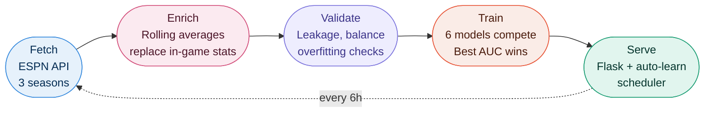
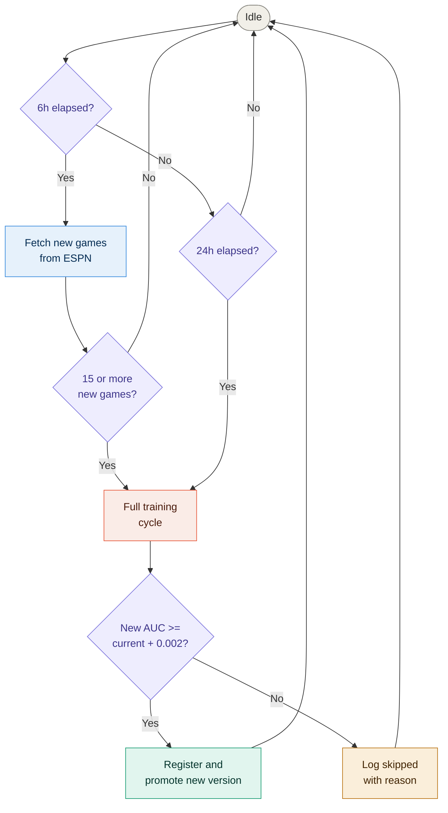
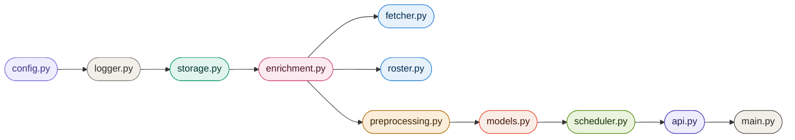

> Please read [LICENSE](https://github.com/Codex-Crusader/Uni-basketball-ETL-pipeline/blob/main/LICENSE) and [DISCLAIMER.md](https://github.com/Codex-Crusader/Uni-basketball-ETL-pipeline/blob/main/DISCLAIMER.md) before using this project.

# NCAA Basketball Outcome Predictor

[](https://uni-basketball-etl-pipeline.onrender.com/)
[](https://www.python.org/)
[](https://flask.palletsprojects.com/)
[](https://scikit-learn.org/)


**[Try the live demo](https://uni-basketball-etl-pipeline.onrender.com/) - no setup, no install, runs in your browser.**
*Note: live demo runs on a mix of synthetic and real NCAA data. Model metrics not indicative of real prediction performance.*

---

Most student ML projects train once on a static dataset and call it done. This one fetches real NCAA game data from ESPN, trains six models in competition, and deploys the winner, then repeats that cycle automatically every time new games are played. It has been running and improving itself since it was first deployed.

The most interesting part is not the accuracy. Early versions had a suspiciously good AUC of **0.9666**. After investigation, the model was caught cheating: it was training on in-game stats, then "predicting" outcomes using data it could only have known after the game ended. The fix dropped the AUC to **~0.74**. That lower number is the honest one, and it is the one worth talking about.

This is a pipeline built to the standards you would expect in a real engineering role: structured logging, versioned model registry with rollback, a REST API, deduplication, leakage detection, adaptive regularisation, and a background scheduler that handles retraining without intervention. No notebooks. No hardcoded values. One command to run the whole thing.

---


<details>
<summary>More screenshots</summary>


</details>

---

## The Part Where I Confess the Model Used to Cheat

Early versions of this project had an AUC of **0.9666**. That sounds great. It was not great.

The feature `home_fg_pct` stored what the home team shot *during the game*. The model learned "teams that shot well won," which is not a prediction. It is a description. The model was just reading the box score and calling it forecasting. Classic leakage.

**The fix:** every feature field now stores a rolling average of the team's last 10 games going into that night. `home_fg_pct = 0.47` means "this team has averaged 47% from the field over their last 10 games." That is knowable before tipoff. That is an actual prediction.

```
v2.4 AUC: 0.9666   (leakage. the model was cheating.)
v2.5 AUC: ~0.74    (honest. the model is trying.)
```

The AUC went down. That is the correct result.

---

## What It Actually Does



**Fetch** pulls real NCAA game data from ESPN's unofficial API across three seasons. No API key required. Around 2900 games total.

**Enrich** walks through every game in chronological order and replaces each team's feature values with rolling averages from their prior games. Games where either team has no history yet are dropped from training entirely.

**Validate** runs four checks before any model sees data: leakage detection (correlation above 0.70 with outcome flags a suspicious feature), near-zero variance, class balance (home win rate should sit between 40% and 70%), and a sample-to-feature ratio check to catch overfitting conditions early.

**Train** fits six models, evaluates each on a held-out test set and with 5-fold cross-validation, and registers the one with the best ROC-AUC. Tree model depth is capped automatically based on dataset size so smaller datasets do not get overfit regardless of what the config says.

**Serve** starts a Flask server with the dashboard and a background scheduler that keeps the whole cycle running on its own.

---

## The Six Contenders

Every training run is a competition. All six models are trained on the same data with the same preprocessing. Best ROC-AUC wins.

| Model | Strengths | Notes |
|-------|-----------|-------|
| Gradient Boosting | Sequential refinement, strong on tabular data | 300 trees, lr=0.05, depth capped at 4 |
| Random Forest | Parallel ensemble, stable importances | Depth capped at 4 on current dataset size |
| Extra Trees | More randomness, better noise tolerance | Won on mixed synthetic+real data for this reason |
| SVM (RBF) | Strong margin classifier, compact | C=2.0, no feature importances available |
| Neural Net (MLP) | Learns nonlinear patterns well | 128-64-32, ReLU, early stopping at 15% validation |
| XGBoost | Often the benchmark beater | Optional install, skipped gracefully if absent |

All models are wrapped in a `StandardScaler -> estimator` sklearn Pipeline. The scaler fits only on the training set. No leakage there either.

**Adaptive depth:** tree models use `max_depth = log2(n_samples / (10 * n_features))`, floored at 3. At 2300 training samples and 14 features, that ceiling is 4 regardless of what is configured.

---

## The 14 Features

All pre-game rolling averages. Nothing derived from the outcome.

| Feature | What it represents |
|---------|-------------------|
| `home_fg_pct` / `away_fg_pct` | Field goal percentage, last 10 games |
| `home_rebounds` / `away_rebounds` | Total rebounds, last 10 games |
| `home_assists` / `away_assists` | Assists, last 10 games |
| `home_turnovers` / `away_turnovers` | Turnovers, last 10 games |
| `home_steals` / `away_steals` | Steals, last 10 games |
| `home_blocks` / `away_blocks` | Blocks, last 10 games |
| `home_ast_to_tov` / `away_ast_to_tov` | Derived: rolling avg assists divided by rolling avg turnovers |

`ast_to_tov` is computed as the ratio of the averages, not the average of the ratios. Small distinction, more accurate result.

**Removed and why:** `home_ppg`, `away_ppg`, `home_eff_score`, `away_eff_score` were all cut in v2.5. They are derived from the final score, which the model is supposed to be predicting.

---

## The Auto-Learn Loop

Once `--serve` is running, a background daemon thread keeps the system current on its own.



The promotion threshold (0.002 AUC) exists so the registry does not fill up with versions that are marginally different and statistically meaningless. Every decision, promoted or skipped, is written to `data/learning_log.json` and visible in the Auto-Learn tab.

---

## Getting Started

```bash
pip install -r requirements.txt
```

Optional extras:

```bash
pip install xgboost                       # adds a sixth model to the competition
pip install snowflake-connector-python    # only needed if using Snowflake storage
```

### First run from scratch

```bash
# Fetch ~2900 real games from ESPN (takes 20-40 minutes)
python main.py --fetch

# No internet or ESPN is being slow? Generate synthetic fallback data instead:
python main.py --generate-synthetic

# Optional: pre-cache rosters for all teams (makes roster mode instant)
python main.py --fetch-rosters

# Train all models, register the best
python main.py --train

# Start the server and the auto-learn scheduler
python main.py --serve
```

Open [http://localhost:5000](http://localhost:5000).

### Upgrading from v2.4

If you have an existing `games.json` from before the leakage fix:

```bash
python main.py --enrich    # back-fills rolling averages into existing records (~2 seconds)
python main.py --train     # retrain on honest data
python main.py --serve
```

---

## All Commands

| Command | What it does |
|---------|-------------|
| `--fetch` | Fetch real NCAA games from ESPN across all configured seasons |
| `--enrich` | Back-fill pre-game rolling averages into an existing games.json |
| `--fetch-rosters` | Pre-fetch and cache player rosters for all teams in the dataset |
| `--generate-synthetic` | Generate 5000 synthetic games as an offline fallback |
| `--train` | Train all models, register the best by ROC-AUC |
| `--serve` | Start the Flask server and background auto-learn scheduler |
| `--list-models` | Print all registered model versions with metrics |
| `--activate v3` | Promote a specific version to active |
| `--max-games N` | Override the max_games config cap for one fetch run |
| `--storage snowflake` | Use Snowflake instead of local JSON |

---

## Configuration

Everything lives in `config.yaml`. Nothing is hardcoded in the source.

```yaml
home_team:
  name: "Duke Blue Devils"    # Change to your team. Must match ESPN display name.

data:
  pregame_window: 10          # How many prior games to average for pre-game features
  pregame_min_games: 1        # Minimum history before a game is training-eligible

ncaa_api:
  seasons: [2022, 2023, 2024]
  max_games: 3000

auto_learn:
  enabled: true
  fetch_interval_hours: 6
  retrain_interval_hours: 24
  min_new_games_to_retrain: 15
  promote_threshold: 0.002

models:
  selection_metric: "roc_auc"
  enabled:
    - gradient_boosting
    - random_forest
    - extra_trees
    - svm
    - mlp
    - xgboost
```

Snowflake credentials are read from environment variables (`SNOWFLAKE_USER`, `SNOWFLAKE_PASSWORD`). Never hardcoded.

---

## Dashboard Tabs

**Predict** - Pick an opponent, choose stats mode or roster mode. Stats auto-fill from season averages. Roster mode lets you select individual players and aggregates their stats live before predicting. The model shows its working: exactly which numbers it used.

**Overview** - Win rates, enrichment coverage, active model radar chart, and a line chart showing AUC progression across every registered version over time.

**Model Comparison** - All six models side by side. Accuracy, precision, recall, F1, ROC-AUC. Bar charts and a multi-model radar.

**Feature Analysis** - Average stats broken down by home wins vs away wins. Per-model feature importance chart with a model selector.

**Registry** - Every registered version with full metrics, training size, and timestamp. One-click to activate any previous version.

**Auto-Learn** - Live scheduler status, countdown to next fetch and retrain, the full learning log, and a manual trigger button for when you do not want to wait.

---

## API Reference

| Method | Endpoint | Description |
|--------|----------|-------------|
| GET | `/` | Dashboard |
| POST | `/predict` | Predict from raw feature values |
| POST | `/predict/from_roster` | Predict from selected player lists |
| GET | `/analytics` | Dataset stats and model comparison |
| GET | `/model_info` | Active model metadata |
| GET | `/registry` | All registered versions |
| POST | `/registry/activate/<version>` | Promote a version |
| GET | `/teams` | All teams with averages |
| GET | `/team_stats/<n>` | Stats for a specific team |
| GET | `/home_team` | Configured home team and stats |
| GET | `/roster/<team>` | Start async roster fetch |
| GET | `/roster/progress/<team>` | Poll roster fetch progress |
| POST | `/roster/refresh/<team>` | Force a fresh fetch |
| GET | `/autolearn/status` | Scheduler state and countdowns |
| POST | `/autolearn/trigger` | Manually trigger a retrain |
| GET | `/learning_log` | Training history |
| GET | `/features` | Feature list and window options |
| GET | `/debug` | Health check |

---

## Project Requirements Checklist

| Requirement | Status |
|-------------|--------|
| SQL database storage via Snowflake |  Provisioned, credentials via env vars. |
| Local development option |  JSON storage with full feature parity. |
| Real data ingestion across multiple seasons |  ESPN API, ~2900 games across 3 seasons. |
| Multiple traditional ML models |  Five models plus optional XGBoost. |
| Training and evaluation pipeline |  With 5-fold cross-validation. |
| Automated model selection |  By ROC-AUC. |
| Python scripts, no notebooks |  |
| Command-line interface |  |
| Model serialization and versioning |  Registry with rollback support. |
| Interactive web dashboard |  Six tabs. |
| Analytics and visualizations |  Charts, radar, feature importances. |
| Automated and manual retraining |  Scheduler plus manual trigger. |
| No hardcoded secrets |  Environment variables throughout. |
| Data drift handling |  Promote threshold guards the registry. |
| Roster-based predictions |  Player selection, FGA-weighted aggregation. |
| Structured logging |  Rotating file handler, module-level loggers. |
| Modular codebase, no circular imports |  Ten modules, one job each. |
| Honest pre-game features, no leakage |  Rolling averages, not in-game stats. |

---

## Known Limitations

**ESPN unofficial API.** No SLA. The endpoint structure could change without notice and break the fetcher.

**Cold-start exclusion.** Each team's first game of a season gets dropped from training because there is no prior history to roll. With three seasons of data this is a small fraction of records, but it is worth knowing.

**Roster stats reliability.** The embedded stats in ESPN's roster response are used when available. The per-player `/statistics` fallback returns 404 for a lot of college players, so roster mode coverage is inconsistent.

**No SHAP values.** Feature importances are raw impurity-based values from the tree models, not Shapley values. Directionally useful, not theoretically rigorous.

**Single-instance Flask.** No gunicorn, no auth. Fine for a demo, not for production.

---

## Technical Stack

| Layer | Technology |
|-------|-----------|
| Language | Python 3.8+ |
| ML | scikit-learn 1.8.0, XGBoost (optional) |
| Web | Flask 3.1.2 |
| Numerical | NumPy 2.4.2 |
| Config | PyYAML 6.0.3 |
| HTTP | requests 2.32.5 |
| Storage | Local JSON / Snowflake |
| Frontend | HTML5, Chart.js 4.4.2, vanilla JS |
| Logging | Python logging, RotatingFileHandler |

---

## File Structure

```
Uni-basketball-ETL-pipeline/
    ├── main.py               CLI entry point
    ├── config.yaml           All settings
    ├── dashboard.html        Frontend
    ├── requirements.txt
    ├── data/
    │    ├── games.json
    │    ├── app.log           Rotating, 10 MB x 2 backups
    │    ├── learning_log.json
    │    ├── team_ids.json
    │    └── rosters/
    ├── models/
    │    ├── registry.json
    │    ├── latest_comparison.json
    │    └── *.pkl
    ├── app/
    │    ├── config.py
    │    ├── logger.py
    │    ├── storage.py
    │    ├── enrichment.py
    │    ├── fetcher.py
    │    ├── roster.py
    │    ├── preprocessing.py
    │    ├── models.py
    │    ├── scheduler.py
    │    └── api.py
    └── Docs/
         ├── Future_dev_map.md
         ├── changelog.md
         ├── code_flow.md
         ├── math.md
         └── variable_list.md
```

**Module dependency order** (no circular imports, each module only imports from above it):



---

## The Point of All This

This project is about engineering, not accuracy. A 74% AUC on honest pre-game data is more defensible than a 97% AUC on a model that needed to watch the game first. The drop from v2.4 to v2.5 was the right result.

The real lesson is that production ML is mostly not about the model. It is about making sure the features mean what you think they mean, building a system that can improve itself when new data arrives, and writing code that someone else can actually read and run.

> Real-world ML is 70% engineering, 30% modeling. And the 30% starts with checking that your features are not accidentally reading the answer off the back of the test paper.

---

*Built with basketball and coffee. Status: ready for academic demonstration.*


